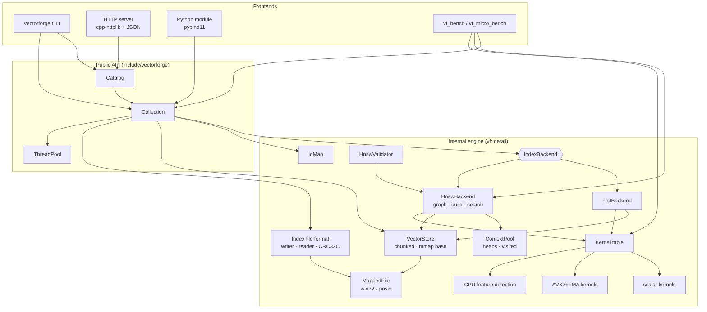
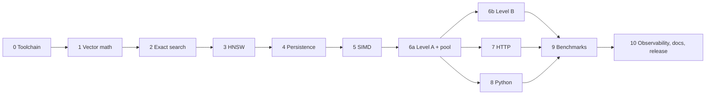

# VectorForge — Engineering Design Document

| | |
|---|---|
| Status | Draft v1 (design phase — no implementation yet) |
| Date | 2026-09-13 |
| Scope | C++20 vector similarity search engine: exact + HNSW search, SIMD, concurrency, persistence, HTTP, Python |
| Audience | Implementers (human or agent), reviewers, interviewers |

> **Rule for this document:** it contains *no performance numbers*. Every quantitative claim about speed or
> recall must come from a benchmark run recorded under `benchmarks/results/` with full environment metadata.
> Where this document reasons about cost it uses asymptotic or byte-count arithmetic only.

---

## 0. Environment inspection (facts this design depends on)

Inspected on 2026-09-13:

| Item | Finding | Design consequence |
|---|---|---|
| Repository | `C:\Users\kavya\Desktop\VectorForge` is **empty**, not a git repo | Greenfield; Phase 0 creates everything, including `git init` |
| OS | Windows 11 (26200) | Windows is a first-class dev target; Linux is a first-class CI target |
| CPU | AMD Ryzen 7 4800H (Zen 2), 8C/16T, L2 4 MB total, L3 8 MB; **AVX2 + FMA yes, AVX-512 no** | AVX2 is the top SIMD tier we can *measure*; AVX-512 is a non-goal |
| RAM | 15.4 GB | 1M × 1536-d float32 = 5.72 GiB raw vectors → feasible only with mmap'd datasets and careful harness; treated as a stretch scenario |
| Compilers | MinGW-w64 GCC 15.2 on PATH; **MSVC 14.50** (VS Build Tools 2026) and MSVC 14.44 (VS 2022 Build Tools) | Primary Windows toolchain: **MSVC + Ninja** (required for Python ABI compatibility with python.org CPython). MinGW GCC is a secondary compile check only |
| CMake / Ninja | Bundled in VS Build Tools (CMake 4.2.3 and 3.31.6), **not on PATH** | Phase 0 adds `tools/dev-env.ps1` that enters the VS developer shell; `cmake_minimum_required(VERSION 3.25)` |
| clang tooling | `clang-format` 19.1.5 (VS 2022 LLVM component); **no clang-tidy, no clang-cl** | clang-format usable locally; clang-tidy runs in Linux CI (optionally install LLVM locally) |
| Sanitizers | MSVC ASan runtime present; **no UBSan/TSan on Windows**; MinGW ships no sanitizer runtimes | ASan locally via MSVC; **UBSan + TSan run on Linux CI** (or local WSL2 if the user installs a distro) |
| Python | CPython 3.14.3, NumPy 2.4.4, **pybind11 not installed** | Bindings require pybind11 ≥ 3.0 (3.14 support) — verify exact version at Phase 8; build with scikit-build-core |
| Docker | Not installed; WSL has no distribution | Dockerfile validated in CI only unless user installs Docker/WSL |
| Power plan | Custom plan active (laptop) | Benchmarks must record power plan, AC power, and thermal caveats |

---

## 1. Executive summary

VectorForge is an in-process and networked vector similarity search engine written in C++20. It stores float32
vectors in named **collections**, supports **exact (brute-force)** and **approximate (HNSW)** k-nearest-neighbour
search under **L2, inner product and cosine** metrics, and exposes the engine through a **C++ library**, a
**CLI**, an **HTTP/JSON API** and **Python bindings** (pybind11, NumPy zero-copy input).

The design optimises for, in priority order:

1. **Correctness that is demonstrable** — every approximate result is checked against a brute-force ground truth;
   the HNSW graph has an invariant validator; the file format is treated as untrusted input.
2. **Reproducibility** — seeded, platform-independent randomness; deterministic single-threaded builds; benchmark
   results carry machine/compiler/commit metadata.
3. **Performance that is measured, not asserted** — every optimisation (AVX2 kernels, prefetching, parallel build,
   mmap) ships behind a switch and with a benchmark comparing it against its baseline.
4. **Explainable concurrency** — two explicit concurrency levels (coarse reader/writer lock first; fine-grained
   concurrent insertion second), each with a written correctness argument and a TSan-backed stress test.

Key architectural choices (justified in §19):

- Core library has **zero third-party dependencies**; server/CLI/tests/benchmarks/python are separate targets.
- Vectors live in a **chunked, 64-byte-aligned, append-only store** with stable addresses; the HNSW graph is stored
  **separately** from vectors (vectors can be mmap'd; graph lives on the heap).
- Distances are always "**lower is better**" internally (squared L2, `1 − cos`, `−dot`).
- SIMD uses **runtime CPU dispatch** (scalar reference + AVX2/FMA kernels in separately compiled translation units),
  so one portable binary/Docker image runs on any x86-64 and on ARM (scalar).
- Deletion is **tombstoning** + offline **compaction** (rebuild and atomic swap), which avoids memory reclamation
  problems entirely.
- Persistence is a **versioned, checksummed, little-endian single-file format** with a page-aligned vector section,
  written atomically (temp file + rename) and referenced through a **generation manifest** (needed because Windows
  cannot replace a file that is currently memory-mapped).

---

## 2. Requirements

### 2.1 Functional

| ID | Requirement |
|---|---|
| F1 | float32 vectors, dimension fixed per collection, `1 ≤ dim ≤ 65 536` |
| F2 | Metrics: L2 (squared), inner product, cosine; cosine implemented as normalise-on-write + dot |
| F3 | Optional normalisation for L2/IP collections (`normalize: true`) |
| F4 | Exact k-NN (FlatIndex) with optimised top-k selection |
| F5 | HNSW index: configurable `M`, `ef_construction`, `ef_search` (per query override), seed |
| F6 | Insert single, insert batch, upsert (explicit flag), get by id, delete (tombstone), compact |
| F7 | Search single and batch; `k`, `ef_search` per request; results = `(external_id, distance)` sorted ascending |
| F8 | Persistence: save/load, versioned format, checksums, mmap-backed vector loading |
| F9 | Collections: create/list/describe/drop; data directory with generational manifests |
| F10 | HTTP API for all of the above plus health, readiness, status, stats, metrics |
| F11 | Python package `vectorforge` with NumPy in/out |
| F12 | CLI: `build`, `search`, `info`, `verify`, `gen-data`, `ground-truth`, `serve` |
| F13 | Benchmark harness producing machine-readable results + plots |

### 2.2 Non-functional

| ID | Requirement |
|---|---|
| N1 | C++20, builds warning-clean on MSVC 14.4x+, GCC 13+, Clang 17+ (warnings-as-errors in CI) |
| N2 | Runs correctly on CPUs without AVX2 (scalar fallback), verified in CI by forcing `VF_SIMD=scalar` and by an ARM64 build |
| N3 | ASan + UBSan clean on the full test suite; TSan clean on concurrency tests |
| N4 | Concurrent searches never block each other; thread-safety documented per public method |
| N5 | Crash during save never corrupts the last good snapshot |
| N6 | Loader never crashes / reads out of bounds on malformed files (fuzzed) |
| N7 | Internal ids are `uint32` → max 2³² − 2 vectors per collection (documented limit) |
| N8 | All randomness seeded and platform-independent (no `std::uniform_*_distribution` — its output is implementation-defined) |
| N9 | Benchmarks record full environment metadata; no number in README without a result file |

---

## 3. Non-goals (v1)

Explicitly out of scope, with reasoning so they aren't silently re-added:

- **Quantisation** (PQ, SQ8, float16), **IVF**, **DiskANN/Vamana** — valuable but each is a project of its own;
  the architecture leaves room (`IndexBackend` interface).
- **AVX-512 / NEON kernels** — cannot be benchmarked on the dev machine (Zen 2). Dispatch table is designed to accept more tiers.
- **Metadata payloads and filtered search** — would change the search loop (filter-aware traversal); deferred.
- **String ids** — `uint64` external ids only; clients can hash.
- **Write-ahead log / per-insert durability** — durability is snapshot-based (explicit or periodic save). Data
  written after the last snapshot is lost on crash. Documented loudly.
- **Distribution / sharding / replication**, **TLS**, **authN/authZ beyond an optional static API key**.
- **In-place graph repair on delete** — tombstones + compaction instead (see §9.9).
- **Lock-free data structures for their own sake** — atomics are used only where a correctness argument shows they
  remove a lock from the read path (§11.4).
- **Python free-threaded (3.14t) builds** — GIL is released during heavy calls; free-threading support is future work.
- **GPU**.

---

## 4. Architecture

### 4.1 Layers

```
 ┌─────────────────────────────── Frontends ───────────────────────────────┐
 │  apps/cli (vectorforge)   src/server (HTTP)   python/_bindings   bench  │
 └───────────────┬───────────────────┬──────────────────┬──────────────────┘
                 │   public API: include/vectorforge/*.hpp                 │
 ┌───────────────▼───────────────────▼──────────────────▼──────────────────┐
 │  Catalog (named collections, data dir, manifests)                        │
 │  Collection (thread-safe façade: validation, id map, locks, snapshots)   │
 ├──────────────────────────────────────────────────────────────────────────┤
 │  detail::IndexBackend  ←  FlatBackend | HnswBackend (graph, build, search)│
 ├──────────────────────────────────────────────────────────────────────────┤
 │  search/: TopK, MinMax heaps, VisitedSet, SearchContext pool             │
 │  storage/: VectorStore (chunked/mmap), IdMap, file format, MappedFile    │
 │  simd/: CPU features, kernel table (scalar | avx2)                       │
 │  concurrency/: ThreadPool, parallel_for, StripedMutex                    │
 │  core/: Status/Result, types, config validation, checked math, RNG       │
 └──────────────────────────────────────────────────────────────────────────┘
```

Dependency rule: a layer may only depend on layers below it. `core` depends on nothing. `simd` depends on `core`.
Nothing below `Collection` knows about HTTP, JSON, Python or the filesystem layout of a catalog.

### 4.2 Module boundaries (A)

| Module | CMake target | Responsibility | Third-party deps |
|---|---|---|---|
| core | `vf_core` (part of `vectorforge` static lib) | `Status`, `Result<T>`, `Metric`, ids, params validation, `checked_mul`, `SplitMix64`/`Xoshiro256**` | none |
| simd | `vectorforge` (+ `vf_simd_avx2` object lib with ISA flags) | kernel implementations and dispatch | none |
| storage | `vectorforge` | `VectorStore`, `IdMap`, `MappedFile`, `BinaryWriter/Reader`, CRC32C, format sections | none |
| search | `vectorforge` (header-mostly, internal) | bounded heaps, visited sets, contexts | none |
| index | `vectorforge` | `FlatBackend`, `HnswBackend`, `HnswValidator` | none |
| concurrency | `vectorforge` | `ThreadPool`, `parallel_for`, `StripedMutex` | none |
| collection | `vectorforge` | `Collection`, `Catalog`, manifests | none |
| server | `vectorforge_server` | HTTP routing, JSON codec, limits, metrics | cpp-httplib, nlohmann/json |
| cli | `vectorforge_cli` (exe `vectorforge`) | commands | CLI11 |
| python | `_vectorforge` module | bindings | pybind11 |
| tests | `vf_tests_*` | GoogleTest suites | GoogleTest |
| benchmarks | `vf_micro_bench`, `vf_bench` | micro + macro benchmarks | Google Benchmark (micro only) |

One static library `vectorforge` (internally organised by directory) rather than eight tiny libraries: fewer link
order problems, LTO-friendly; the directory boundaries plus include rules (`src/` headers never included from
`include/`) enforce modularity. The only split is the AVX2 object library, because it needs different compile flags.

### 4.3 Public vs internal APIs (B)

- **Public** (`include/vectorforge/`, installed, semver-governed): `status.hpp`, `types.hpp`, `config.hpp`,
  `collection.hpp`, `catalog.hpp`, `distance.hpp` (scalar-API distance functions for users), `thread_pool.hpp`,
  `simd.hpp` (query active SIMD level), `version.hpp`, umbrella `vectorforge.hpp`.
- Public headers **must not** include `<immintrin.h>`, `<atomic>`-heavy internals, httplib, json or pybind11.
- `Collection` uses **pimpl** (`std::unique_ptr<Impl>`): the indirection is per API call, not per distance
  computation, so it is free in practice, and it hides graph/atomic/SIMD details and keeps dependents' compile times low.
- **Internal** (`src/**`, namespace `vf::detail`): everything else. Tests and benchmarks link the internal include
  path deliberately (to test `HnswBackend` or kernels in isolation); frontends must not.

### 4.4 Ownership and lifetime (C)

| Object | Owned by | Lifetime rule |
|---|---|---|
| `Catalog` | application (`main`, server) | outlives the server; destroys collections on shutdown after in-flight requests drain |
| `Collection` | `Catalog` via `std::shared_ptr<Collection>` | HTTP handlers copy the `shared_ptr` for the duration of a request, so `DROP` never frees a collection under an in-flight search |
| `CollectionState` (index + stores) | `Collection` via `std::shared_ptr<CollectionState>` | swapped on compaction/load; readers holding the old state keep it alive (refcount = reclamation) |
| `VectorStore` chunks | `VectorStore` via `std::unique_ptr<float[], AlignedDeleter>` or a `MappedFile` | chunks never move or free while the store lives (stable addresses) |
| `MappedFile` | `VectorStore` (base segment) | move-only RAII; unmapped in destructor |
| `SearchContext` | `ContextPool` inside backend | borrowed per query via RAII lease, returned on scope exit |
| Thread pool | application or `Catalog` (shared), or caller-provided pointer | APIs take `ThreadPool*` (non-owning, nullable = run inline) |
| Python `Index` | Python refcount via `std::shared_ptr` holder | NumPy inputs are borrowed only during the call |

No raw owning pointers. Non-owning references are `T&`, `T*` (nullable), `std::span`, `std::string_view`.

### 4.5 Memory layout (D) and cache locality (E)

**Vectors** — structure-of-arrays, row-major, one contiguous row per vector:

```
chunk k (64-byte aligned):  [ v(k·C) : dim×f32 ][ v(k·C+1) ] ... [ v(k·C + C−1) ]
directory: std::array<std::atomic<float*>, MaxChunks>   C = 2^16 rows (configurable power of 2)
row(i) = directory[i >> log2C] + (i & (C−1)) * dim
```

- *Implementation note (Phase 1):* the default chunk size is dimension-adaptive — the largest power of two
  ≤ 16 MiB / (4·dim) rows, capped at 2¹⁶ (e.g. 32 768 rows at d=128, 2 048 rows at d=1536) — so small collections
  do not pay for a 400 MB chunk at high dimension. The chunk directory is a `std::vector` of owning pointers
  (thread-compatible); Phase 6b replaces it with a fixed-capacity directory of atomic pointers for lock-free readers.
- Chunking gives **stable addresses** (no `std::vector` reallocation invalidating pointers held by concurrent
  readers) without requiring a `max_elements` up front. The cost is one shift/mask and one extra load per row
  access; benchmarked against a single contiguous buffer (`VectorStore` has a "single segment" fast path when the
  store is loaded from disk and not yet appended to).
- 64-byte alignment = cache-line alignment; also future-proofs aligned AVX-512 loads. Kernels still use unaligned
  loads (§10.2).
- A loaded collection's base segment may be a **read-only mmap view**; appends go to heap chunks after it.

**Graph** — separate from vectors (unlike designs that interleave vector + links per node). Rationale: during
search the access pattern is `links[c]` → `vector[n₁..n_k]` for neighbours `n_i ≠ c`; interleaving `c`'s own vector
with `c`'s links does not remove the dominant misses (neighbour vectors), while separation lets vectors be mmap'd,
shared with `FlatBackend`, and persisted as one bulk section. The dominant misses are attacked with **software
prefetch** of neighbour vectors and visited-marks (benchmarked on/off). Layout in §9.1.

**Search scratch** — per-query heaps and visited marks are pre-allocated in pooled `SearchContext`s, so the steady
state query path performs **zero heap allocations** (verified by a counting-allocator test).

### 4.6 Concurrency model summary (F)

Two levels, delivered in order (full design and proofs in §11):

- **Level A (Phase 6a):** backends are *thread-compatible* (like STL containers). `Collection` wraps them with a
  `std::shared_mutex`: searches shared, mutations exclusive. Parallelism = many concurrent searches, parallel batch search.
- **Level B (Phase 6b):** `HnswBackend` supports *concurrent insertion* (parallel build) and *searches concurrent with
  inserts*, using atomic link slots read without locks, striped mutexes for writers, and a "node is reachable only
  when fully initialised" publication protocol. Level A remains the fallback if B fails its gates.

### 4.7 Error handling (M)

- Expected failures (bad input, not found, I/O, corrupt file, version mismatch) return `vf::Status` /
  `vf::Result<T>` — a small type mirroring `std::expected` (C++23) so migration is mechanical.
- Error codes: `InvalidArgument`, `DimensionMismatch`, `NotFound`, `AlreadyExists`, `CorruptData`,
  `UnsupportedVersion`, `IoError`, `ResourceExhausted`, `FailedPrecondition`, `Unavailable`, `Internal`.
- Hot internal paths are `noexcept` and assume validated input (`VF_ASSERT` in debug builds). Validation happens
  once at the `Collection` boundary: dimension, finiteness (NaN/Inf rejected — a NaN distance violates the strict
  weak ordering of the heaps, which is UB), zero-norm for cosine, id range.
- `std::bad_alloc` propagates (treated as fatal at the frontend: HTTP 507/500, Python `MemoryError`).
- Frontends translate: HTTP status codes (§13.4), Python exceptions (`ValueError`, `KeyError`, `IOError`, custom
  `vectorforge.CorruptIndexError`).
- Exceptions stay enabled (STL, httplib need them); the core simply does not use them for control flow.

### 4.8 Configuration (N)

- Typed structs with defaults + `validate() -> Status`: `CollectionConfig { dim, metric, normalize, index }`,
  `HnswParams { M=16, ef_construction=200, ef_search=50, max_level=16, seed }`, `FlatParams {}`,
  `LoadOptions { use_mmap=true, verify=Checksums::Metadata|Full|None, prefault=false }`,
  `ServerConfig { host="127.0.0.1", port=8080, http_threads, compute_threads, data_dir, max_body_bytes, max_k,
  max_batch, api_key, snapshot_interval }`.
- Precedence for the server: CLI flag > environment variable (`VF_PORT`, …) > optional JSON config file > default.
- Runtime override for SIMD: `VF_SIMD=auto|scalar|avx2` (downgrade only; requesting an unsupported tier is an error).
- Defaults are documented in one table (`docs/configuration.md`) generated from the structs' doc comments.

---

## 5. Component diagram



---

## 6. Data flow

### 6.1 Insert (single / batch)

```mermaid
sequenceDiagram
  participant C as Client
  participant F as Frontend
  participant COL as Collection
  participant IDM as IdMap
  participant VS as VectorStore
  participant H as HnswBackend
  C->>F: insert(id, vector)
  F->>COL: add(ids, rows)
  COL->>COL: validate dim, finite, norm (normalize into scratch if cosine)
  COL->>IDM: reserve(id) → PENDING (AlreadyExists unless upsert)
  COL->>VS: append row → internal id i (address stable)
  COL->>H: insert(i)  [search layers top-down, select neighbours,<br/>write own lists, then back-links, then entry point]
  COL->>IDM: commit(id → i); if upsert: tombstone old internal id
  COL-->>F: Status::Ok
```

Batch insert: validation of the whole batch first (all-or-nothing on validation errors), then insertion in
parallel (Level B) or sequentially under the exclusive lock in sub-batches (Level A, lock released between
sub-batches of e.g. 1 000 so searches are not starved). Partial failure after validation is only possible on
allocation failure; the response reports the number inserted.

### 6.2 Search

```mermaid
sequenceDiagram
  participant C as Client
  participant COL as Collection
  participant H as HnswBackend
  participant P as ContextPool
  participant K as Kernels
  C->>COL: search(q, k, ef)
  COL->>COL: validate; normalise q if cosine (stack/ctx scratch)
  COL->>H: search(q, k, ef) [shared lock or lock-free per level]
  H->>P: lease SearchContext
  H->>H: read (entry, max_level) atomically
  loop level L..1
    H->>K: greedy descent (ef=1)
  end
  H->>K: search_layer(level 0, ef=max(ef,k)), skipping tombstones in result set
  H-->>COL: top-k internal ids + distances (sorted)
  COL->>COL: map internal → external ids (append-only array)
  COL-->>C: [(id, distance)] ascending
```

### 6.3 Persistence

`save`: block writers (not readers) → write `index.<gen+1>.vfidx.tmp` section by section with CRC32C → flush + fsync
→ rename to final name → write `MANIFEST.tmp` → fsync → rename to `MANIFEST` → (POSIX) fsync directory → release
writers → delete old generation when no live `CollectionState` maps it.

`load`: read `MANIFEST` → open generation file → validate header + section table (bounds, overflow, versions) →
verify checksums per `LoadOptions` → mmap vector section (or read into heap) → read graph into heap → validate
graph invariants cheaply (ids < count, counts ≤ caps) → publish `CollectionState`.

---

## 7. Directory structure

```
VectorForge/
├── CMakeLists.txt                 # top-level: options, targets via add_subdirectory
├── CMakePresets.json              # msvc-{debug,release,asan}, linux-{gcc,clang}-{release,asan-ubsan,tsan}, mingw-release
├── cmake/
│   ├── CompilerWarnings.cmake     # per-compiler warning sets, VF_WARNINGS_AS_ERRORS
│   ├── Sanitizers.cmake           # VF_SANITIZE=address;undefined | thread
│   ├── SimdFlags.cmake            # per-TU ISA flags for the avx2 object library
│   ├── Dependencies.cmake         # FetchContent pins (tag + URL_HASH) / VF_USE_SYSTEM_DEPS
│   └── vectorforgeConfig.cmake.in # find_package support for installed lib
├── include/vectorforge/           # PUBLIC headers only
│   ├── vectorforge.hpp  version.hpp  status.hpp  types.hpp  config.hpp
│   ├── collection.hpp  catalog.hpp  distance.hpp  thread_pool.hpp  simd.hpp
├── src/
│   ├── core/          status.cpp  validation.{hpp,cpp}  checked_math.hpp  rng.hpp  assert.hpp  aligned_alloc.hpp
│   ├── simd/          cpu_features.{hpp,cpp}  kernels.hpp  dispatch.cpp  kernels_scalar.cpp  kernels_avx2.cpp
│   ├── storage/       vector_store.{hpp,cpp}  id_map.{hpp,cpp}  mapped_file.hpp  mapped_file_win32.cpp
│   │                  mapped_file_posix.cpp  crc32c.{hpp,cpp}  binary_io.{hpp,cpp}  format.hpp
│   │                  index_writer.cpp  index_reader.cpp  manifest.{hpp,cpp}  atomic_file.{hpp,cpp}
│   ├── search/        topk.hpp  heaps.hpp  visited_set.hpp  search_context.hpp  context_pool.hpp
│   ├── index/         index_backend.hpp  flat_backend.{hpp,cpp}
│   │   └── hnsw/      hnsw_params.cpp  hnsw_graph.{hpp,cpp}  level_generator.hpp  neighbor_select.hpp
│   │                  hnsw_insert.cpp  hnsw_search.cpp  hnsw_backend.{hpp,cpp}  hnsw_validator.{hpp,cpp}
│   │                  hnsw_io.cpp
│   ├── concurrency/   thread_pool.cpp  parallel_for.hpp  striped_mutex.hpp
│   ├── collection/    collection.cpp  collection_state.hpp  catalog.cpp
│   ├── server/        server.{hpp,cpp}  routes_*.cpp  json_codec.{hpp,cpp}  limits.hpp  metrics.{hpp,cpp}
│   └── util/          timer.hpp  memory_stats.{hpp,cpp}  dataset_io.{hpp,cpp} (npy/fvecs/ivecs)
├── apps/
│   └── cli/           main.cpp  cmd_build.cpp  cmd_search.cpp  cmd_info.cpp  cmd_serve.cpp  cmd_gen.cpp  cmd_gt.cpp
├── tests/
│   ├── unit/          test_status.cpp  test_kernels.cpp  test_topk.cpp  test_vector_store.cpp  test_hnsw_*.cpp ...
│   ├── integration/   test_recall.cpp  test_persistence.cpp  test_corruption.cpp  test_catalog.cpp
│   ├── concurrency/   test_thread_pool.cpp  test_concurrent_search.cpp  test_parallel_build.cpp  test_rw_stress.cpp
│   ├── http/          test_routes.cpp  test_limits.cpp
│   ├── fuzz/          fuzz_index_reader.cpp  fuzz_json_request.cpp   (clang/libFuzzer, Linux CI)
│   ├── support/       test_data.hpp  brute_force_reference.hpp  counting_allocator.hpp
│   └── data/golden/   v1_flat_small.vfidx  v1_hnsw_small.vfidx  (+ generator script)
├── benchmarks/
│   ├── micro/         bench_kernels.cpp  bench_topk.cpp  bench_visited.cpp  bench_heap.cpp
│   ├── macro/         vf_bench.cpp  scenario.{hpp,cpp}  report_json.cpp
│   ├── configs/       smoke.json  sweep_hnsw.json  simd.json  threads.json  scale.json
│   ├── scripts/       run_suite.py  plot_results.py  make_readme_tables.py
│   └── results/       <date>_<machine>_<sha>/*.json  (committed raw results)
├── python/
│   ├── pyproject.toml  (scikit-build-core)
│   ├── src/vectorforge/__init__.py  _bindings.cpp
│   └── tests/         test_index.py  test_io.py  test_threads.py
├── examples/          cpp/quickstart.cpp  python/quickstart.py  http/curl_examples.sh
├── tools/             dev-env.ps1  datasets/fetch.py  datasets/hdf5_to_npy.py  run_clang_tidy.py  format.py
├── docs/
│   ├── DESIGN.md (this file)  architecture.md  hnsw.md  simd.md  concurrency.md  storage-format.md
│   ├── http-api.md  openapi.yaml  python-api.md  testing.md  benchmarking.md  configuration.md
│   └── adr/           0001-hnsw-from-scratch.md  0002-runtime-simd-dispatch.md  ...
├── .github/workflows/ ci.yml  sanitizers.yml  lint.yml  python.yml  docker.yml  release.yml
├── Dockerfile  docker-compose.yml  .dockerignore
├── .clang-format  .clang-tidy  .editorconfig  .gitignore  .gitattributes
├── LICENSE (MIT — assumption, change if desired)  README.md  CHANGELOG.md
```

Deviations from the suggested layout, with reasons:

- **`apps/`** holds executables so `src/` is purely library code.
- **`src/server/`** is a *library* (`vectorforge_server`) so HTTP tests run the server in-process on an ephemeral
  port; `vectorforge serve` is a thin CLI command.
- **`benchmarks/results/`** stores raw JSON so every README number is traceable to a file.
- **`docs/adr/`** records major decisions (Architecture Decision Records) as they are made/changed.

---

## 8. Public APIs

### 8.1 C++ API

```cpp
#include <vectorforge/vectorforge.hpp>

namespace vf {

enum class Metric : std::uint8_t { L2, InnerProduct, Cosine };
enum class IndexType : std::uint8_t { Flat, Hnsw };
using ExternalId = std::uint64_t;

struct Neighbor { ExternalId id; float distance; };           // distance: lower is better (see table)

struct HnswParams {
  std::uint32_t M = 16;                 // max links per node on levels ≥ 1; level 0 uses 2·M
  std::uint32_t ef_construction = 200;
  std::uint32_t ef_search = 50;         // default; per-query override
  std::uint8_t  max_level = 16;         // hard cap on generated levels
  std::uint64_t seed = 0x5EEDF0A6EULL;
  Status validate() const;
};

struct CollectionConfig {
  std::uint32_t dim = 0;
  Metric metric = Metric::L2;
  bool normalize = false;               // forced true for Cosine
  IndexType index = IndexType::Hnsw;
  HnswParams hnsw{};
  Status validate() const;
};

struct SearchParams { std::uint32_t k = 10; std::optional<std::uint32_t> ef_search; };
struct InsertOptions { bool upsert = false; };
struct LoadOptions { bool use_mmap = true; Verify verify = Verify::Metadata; bool prefault = false; };

struct CollectionStats {
  std::uint64_t live_count, deleted_count;
  std::uint32_t dim; Metric metric; IndexType index;
  MemoryBreakdown memory;               // vectors, level0 links, upper links, id map, tombstones, contexts
  std::optional<HnswGraphStats> graph;  // level histogram, entry point, avg out-degree per level
  SimdLevel simd;
};

class Collection {
 public:
  static Result<std::unique_ptr<Collection>> create(const CollectionConfig& cfg);
  static Result<std::unique_ptr<Collection>> load(const std::filesystem::path& file, const LoadOptions& = {});

  // Thread-safe (all methods). Level A: mutations exclusive; Level B: concurrent mutations allowed for HNSW.
  Status add(ExternalId id, std::span<const float> vector, InsertOptions = {});
  Result<std::size_t> add_batch(std::span<const ExternalId> ids, std::span<const float> rows /* n·dim */,
                                InsertOptions = {}, ThreadPool* pool = nullptr);
  Status remove(ExternalId id);                                  // tombstone
  Result<std::vector<float>> get(ExternalId id) const;           // copy (normalised if cosine)
  bool contains(ExternalId id) const;

  Result<std::vector<Neighbor>> search(std::span<const float> query, const SearchParams& = {}) const;
  // Zero-allocation variant: writes ≤ k results, returns count.
  Result<std::size_t> search_into(std::span<const float> query, const SearchParams&, std::span<Neighbor> out) const;
  // Batch: out has nq·k slots (row-major); counts[i] = results for query i (< k if collection small).
  Status search_batch(std::span<const float> queries, std::size_t nq, const SearchParams&,
                      std::span<ExternalId> out_ids, std::span<float> out_dist,
                      std::span<std::uint32_t> counts, ThreadPool* pool = nullptr) const;

  Status save(const std::filesystem::path& file) const;          // atomic; blocks writers, not readers
  Status compact(ThreadPool* pool = nullptr);                    // rebuild without tombstones, atomic swap
  CollectionStats stats() const;
  const CollectionConfig& config() const noexcept;

  ~Collection();                                                 // pimpl
 private:
  struct Impl; std::unique_ptr<Impl> impl_;
};

class Catalog {                                                  // named collections under a data directory
 public:
  static Result<std::unique_ptr<Catalog>> open(const std::filesystem::path& data_dir, const LoadOptions& = {});
  Result<std::shared_ptr<Collection>> create(std::string_view name, const CollectionConfig&);
  Result<std::shared_ptr<Collection>> get(std::string_view name) const;
  Status drop(std::string_view name);
  std::vector<std::string> list() const;
  Status snapshot(std::string_view name);                       // generation-based save
  Status snapshot_all();
};

class ThreadPool {
 public:
  explicit ThreadPool(std::size_t threads = std::thread::hardware_concurrency());
  template <class F> auto submit(F&& f) -> std::future<std::invoke_result_t<F>>;
  void parallel_for(std::size_t begin, std::size_t end, std::size_t grain,
                    const std::function<void(std::size_t, std::size_t)>& body);  // rethrows first exception
  std::size_t size() const noexcept;
};

SimdLevel active_simd_level() noexcept;
float distance(Metric, std::span<const float> a, std::span<const float> b);   // convenience, dispatched

}  // namespace vf
```

Distance semantics (identical in every frontend):

| Metric | Internal & returned `distance` | Order |
|---|---|---|
| `L2` | `Σ (aᵢ − bᵢ)²` (squared; no sqrt — monotone, cheaper) | ascending |
| `InnerProduct` | `−⟨a, b⟩` | ascending |
| `Cosine` | `1 − ⟨â, b̂⟩` ∈ [0, 2] (vectors normalised on write and query) | ascending |

Example:

```cpp
auto col = vf::Collection::create({.dim = 768, .metric = vf::Metric::Cosine,
                                   .hnsw = {.M = 16, .ef_construction = 200}}).value();
vf::ThreadPool pool;
col->add_batch(ids, rows, {}, &pool).value();
auto hits = col->search(query, {.k = 10, .ef_search = 100}).value();
col->save("wiki.vfidx").ok();
auto loaded = vf::Collection::load("wiki.vfidx", {.use_mmap = true}).value();
```

Thread-safety contract table (published in `docs/concurrency.md` and in header comments):

| Operation | Level A | Level B (HNSW) |
|---|---|---|
| `search*`, `get`, `contains`, `stats` | concurrent with each other | concurrent with each other **and** with add/remove |
| `add*`, `remove` | exclusive | concurrent with each other and with searches |
| `save` | concurrent with reads; blocks writers | same |
| `compact`, `load` | builds aside; brief exclusive swap | same |
| Destruction | caller must ensure no concurrent use (or hold via `shared_ptr`) | same |

### 8.2 CLI

```bash
vectorforge gen-data --n 100000 --dim 768 --dist gaussian-mixture --clusters 100 --seed 1 --out base.npy
vectorforge gen-data --n 10000  --dim 768 --dist gaussian-mixture --clusters 100 --seed 2 --out queries.npy
vectorforge ground-truth --base base.npy --queries queries.npy --metric cosine --k 100 --out gt   # gt.ids.npy + gt.distances.npy; --threads from Phase 6
vectorforge build  --input base.npy --metric cosine --index hnsw --M 16 --ef-construction 200 --threads 16 --out idx.vfidx
vectorforge search --index idx.vfidx --queries queries.npy --k 10 --ef 100 --threads 16 --out results.npy [--gt gt]
vectorforge info   idx.vfidx          # header, sections, params, level histogram
vectorforge verify idx.vfidx          # full checksum + graph invariant validation; non-zero exit on failure
vectorforge serve  --data-dir ./data --host 127.0.0.1 --port 8080 --http-threads 16 --compute-threads 16
```

Input formats: `.npy` (float32, C-order, little-endian; parsed by our own reader so it can be mmap'd), `.fvecs`,
`.ivecs`, `.bvecs` (TEXMEX). HDF5 (ann-benchmarks) is converted by `tools/datasets/hdf5_to_npy.py` so the C++
side never depends on HDF5.

HTTP and Python APIs are specified in §13 and §14.

---

## 9. HNSW design

Conceptual source: Malkov & Yashunin, *"Efficient and robust approximate nearest neighbor search using
Hierarchical Navigable Small World graphs"* (IEEE TPAMI 2018, arXiv:1603.09320) — Algorithms 1–5. The
implementation below is our own; where we deviate from the paper (ordering of link publication, tie-breaking,
tombstones) it is called out explicitly.

### 9.1 Node representation and graph storage (G)

Internal id `i ∈ [0, capacity)` is dense `uint32_t`. `kInvalid = 0xFFFFFFFF`.

```
Per-node fixed data (chunked arrays, same chunk size C as VectorStore, stable addresses):
  level[i]        : uint8_t               top level of node i (0..max_level)
  l0[i]           : LinkList0             { atomic<uint32_t> count; atomic<uint32_t> ids[M0]; }  stride = 4·(1+M0) bytes
  upper[i]        : uint32_t              offset into UpperArena, valid iff level[i] ≥ 1
  tombstone       : atomic<uint64_t>[⌈N/64⌉]  bitset (Phase 3 uses plain uint64_t; Phase 6b switches to atomic)
  label[i]        : uint64_t              external id (owned by Collection's IdMap reverse array)

UpperArena (chunked, append-only):
  block for node i = level[i] × LinkListM   where LinkListM = { count; ids[M] }  stride 4·(1+M)
  list for (i, L≥1) = arena[upper[i] + (L−1)·stride_M]
```

Why this layout:

- **Level 0 is fixed-stride** because every node has it and it is the hottest data during search: address =
  `base + i·stride`, no indirection, good spatial locality for neighbour ids.
- **Upper levels are a variable-size arena** because only ~1/M of nodes have them (§9.2); fixed per-node space
  for all levels would waste `max_level·4(1+M)` bytes per node.
- **Counts + ids as `std::atomic<uint32_t>`** (from Phase 6b) have the same size and representation cost on x86 as
  `uint32_t` loads/stores; they make lock-free reading well-defined C++ (§11.4). Phase 3 is written against a small
  `LinkView` accessor so the switch from plain to atomic is local to `hnsw_graph.hpp`.
- The graph is **never mmap'd**: it is small relative to vectors, must be mutable, and atomics are not
  implicit-lifetime types, so aliasing file bytes as `std::atomic` would be UB. It is read into heap memory on load.

### 9.2 Level generation

- Paper: `level = ⌊−ln(U) · mL⌋`, `U ~ Uniform(0,1]`, `mL = 1/ln(M)`. Then `P(level ≥ l) = M^(−l)` and expected
  number of upper levels per node `= Σ_{l≥1} M^(−l) = 1/(M−1)`.
- **Determinism:** `U` is derived from `SplitMix64(seed ⊕ SplitMix64(internal_id))`, taking the top 53 bits
  → `(bits + 1) · 2^−53` ∈ (0, 1] (never 0, so `ln` is finite). Because the level depends only on
  `(seed, internal_id)`, the level assignment is identical regardless of thread interleaving in parallel builds,
  and identical across compilers/standard libraries (we do not use `std::uniform_real_distribution`, whose output is
  implementation-defined).
- `level = min(level, max_level)` (cap 16 by default; with M=16 reaching level 16 has probability 16^−16).
- Tested: empirical level histogram over 10⁶ ids matches `M^(−l)` within statistical tolerance for fixed seeds.

### 9.3 Neighbour lists and capacities

- `M` — target and cap on levels ≥ 1 (`Mmax = M`).
- `M0 = 2·M` — cap on level 0 (`Mmax0`), following the paper's recommendation.
- When inserting node `q`, at each level it gets up to `M` neighbours chosen by the heuristic; back-links may push a
  neighbour's list beyond its cap, triggering shrinking with the same heuristic.
- Invariants (checked by `HnswValidator`): `count ≤ cap(level)`; no self-links; no duplicate ids in a list;
  every id `< node_count`; a node appears in level-L lists only if `level[id] ≥ L`; entry point has `level == max_level`.

### 9.4 Distance comparisons and tie-breaking

All heaps order by the pair `(distance, internal_id)` lexicographically. Without an id tie-break, the result of
equal-distance comparisons depends on heap implementation details, which makes graphs non-reproducible and makes
duplicate-vector datasets behave erratically. Since NaN is rejected at the API boundary, this is a strict weak ordering.

### 9.5 Search primitives

Per-query `SearchContext` (pooled): `VisitedSet`, `candidates` (min-heap), `results` (bounded max-heap), scratch vectors.

**`VisitedSet`** — epoch-stamped array: `std::vector<uint16_t> mark(capacity)`, `uint16_t epoch`. `visit(i)`:
`if mark[i]==epoch return false; mark[i]=epoch; return true`. `reset()`: `++epoch`; on wrap-around `fill(0)` and
`epoch=1`. Reset is O(1) amortised versus O(N) clearing; memory = 2 bytes × capacity per context. Alternative to
benchmark in Phase 9: small open-addressing hash set sized to `O(ef·M0)`, which can win for huge N with small ef
because the stamped array has poor locality. Contexts grow lazily when capacity grows (writer path only).

**`greedy_search(q, ep, L)`** (ef = 1, used on levels > target level):

```
cur ← ep; d_cur ← dist(q, cur)
repeat
  changed ← false
  for n in links(cur, L):
     d ← dist(q, n)
     if (d, n) < (d_cur, cur): cur, d_cur ← n, d; changed ← true
until not changed
return (cur, d_cur)
```

No visited set is needed because distance strictly decreases (lexicographic), so it terminates.

**`search_layer(q, entry_points, ef, L, filter)`** (paper Alg. 2):

```
visited.reset(); C ← min-heap; W ← bounded max-heap(capacity ef)
for e in entry_points: visited.visit(e); d ← dist(q,e); C.push(d,e); if accept(e): W.push(d,e)
while C not empty:
   (d_c, c) ← C.pop_min()
   if |W| = ef and (d_c, c) > W.top(): break              # nearest candidate worse than worst result
   prefetch links of top candidates (optional)
   for n in links(c, L):                                  # snapshot count once, then read ids
      if not visited.visit(n): continue
      prefetch vector(n+next) (optional)
      d ← dist(q, n)
      if |W| < ef or (d, n) < W.top():
         C.push(d, n)
         if accept(n): W.push(d, n); if |W| > ef: W.pop_max()
return W
```

`accept(n)` = `!tombstoned(n)` for user queries; during construction all nodes are accepted (tombstoned nodes still
serve as navigation hubs). Subtle point: when tombstones exist, `W` can contain fewer than `ef` items for longer,
so the break condition triggers later — search cost grows with the tombstone fraction. This is expected and is the
reason for `compact()`; `stats()` exposes `deleted_ratio`, and the server can auto-suggest compaction above a
threshold (e.g. 20%).

**Query (paper Alg. 5):**

```
(ep, Lmax) ← load packed entry atomically
if ep invalid: return []
for L = Lmax down to 1: ep ← greedy_search(q, ep, L)
W ← search_layer(q, {ep}, max(ef_search, k), 0, accept = not tombstoned)
return k smallest of W, ascending
```

### 9.6 Insertion (paper Alg. 1) with explicit publication order

```
insert(i):                             # vector already stored at row i, label set, level ℓ = level_of(i)
  allocate upper-level block for i if ℓ ≥ 1 (all counts 0)
  (ep, Lmax) ← entry snapshot
  if ep invalid: publish entry (i, ℓ) via CAS; return            # first node
  # --- Phase 1: pure reads — compute neighbour sets for every level ---
  for L = Lmax down to ℓ+1: ep ← greedy_search(vec(i), ep, L)
  eps ← {ep}
  for L = min(ℓ, Lmax) down to 0:
     W ← search_layer(vec(i), eps, ef_construction, L, accept = all)
     N[L] ← select_neighbors(i, W, M)                           # heuristic §9.7
     eps ← W                                                     # paper: next level starts from all of W
  # --- Phase 2: write i's own lists (i is still unreachable) ---
  for L in 0..min(ℓ, Lmax): write_list(i, L, N[L])
  # --- Phase 3: back-links — i becomes reachable here ---
  for L in 0..min(ℓ, Lmax):
     for n in N[L]:
        lock(n)                                                  # Level B: striped mutex; Level A: no-op
        if count(n,L) < cap(L): append i
        else: new ← select_neighbors(n, links(n,L) ∪ {i}, cap(L)); overwrite list(n,L) with new
        unlock(n)
  # --- Phase 4: entry point ---
  if ℓ > Lmax: CAS entry (ep, Lmax) → (i, ℓ)   (retry loop: only raise, never lower)
```

**Deviation from the paper:** the paper connects each level as it descends. We compute all neighbour sets first,
then write `i`'s own lists, then back-links. In the single-threaded case this is equivalent, because the level-`L`
search result `W` (not the new links) seeds level `L−1`. In the concurrent case it establishes the invariant
**"a node is reachable only after all of its own link lists are written"**. Without it a concurrent search could
descend into `i` at level `L` and find `i`'s level-`L−1` list empty, collapsing that query's recall.

Nodes whose level exceeds the current `Lmax` have no neighbours on levels `(Lmax, ℓ]` — they become the new entry
point there, exactly as in the paper.

Overwriting a list during shrinking: compute the new list into a local buffer, write ids `0..n−1`, then store the
count. Stale ids past the new count are left in place (never zeroed) — see §11.4 for why that matters.

### 9.7 Neighbour selection heuristic (paper Alg. 4)

```
select_neighbors(base, candidates W, M, keep_pruned = true):
  sort W ascending by (dist(base, ·), id)
  R ← []; discarded ← []
  for (d_e, e) in W:
     if |R| = M: break
     good ← true
     for r in R:
        if dist(e, r) < d_e: good ← false; break                # e is closer to an already selected neighbour than to base
     if good: R.push(e) else discarded.push(e)
  if keep_pruned: fill R from discarded (ascending) until |R| = M
  return R
```

- **Why the heuristic:** simple "M closest" selection clusters links inside dense regions; the heuristic prefers
  neighbours in *different directions*, which keeps cross-cluster bridges and improves connectivity on clustered
  data. The paper reports it matters most for clustered/low-intrinsic-dimension data — we measure both
  (`select=simple|heuristic` is a benchmarked build parameter).
- **Cost:** `O(|W|·M)` extra distance computations (vector–vector, not query–vector) per selection — the dominant
  construction cost besides `search_layer`.
- **`keep_pruned` default = true.** Degenerate case motivating it: many identical vectors. All `dist(e, r) = 0` and
  `d_e = 0`, so the strict `<` keeps them "good"… but with near-duplicates (`dist(e,r) ≈ 0 < d_e`) the heuristic keeps
  only one neighbour, starving out-degree and disconnecting the graph. Filling up to M with pruned candidates
  restores out-degree. A dedicated test inserts 1 000 identical and 1 000 near-identical vectors and asserts
  `search` returns `k` results and the validator reports full reachability.
- The paper's optional `extendCandidates` is not implemented initially (documented; can be benchmarked later).

### 9.8 efSearch and efConstruction

- `ef_construction` controls the beam width while building: larger → better neighbour candidates → higher recall at
  a given `ef_search`, linear-ish increase in build time. Validation: `ef_construction ≥ M`.
- `ef_search` controls the beam at query time: effective beam `= max(ef_search, k)`. It is the main recall/latency
  knob; benchmarks sweep it to produce recall-vs-QPS Pareto curves (§16).
- Both are exposed per collection; `ef_search` is overridable per query (capped by `ServerConfig::max_ef`).

### 9.9 Deletion

- `remove(id)`: set tombstone bit for the internal id; IdMap erases the external id. The node stays in the graph
  as a navigation hub; searches never return it (`accept` filter).
- **Upsert** = insert new internal id + tombstone old. Vectors are never overwritten in place, so concurrent
  readers never observe a torn vector.
- `compact()`: build a fresh `CollectionState` from live vectors (optionally in parallel), then swap the
  `shared_ptr` under a brief exclusive lock. Old state is reclaimed when the last reader drops its reference.
  Internal ids change; external ids do not.
- Rejected alternative: in-place deletion with neighbour repair (reconnect in-neighbours of the deleted node). It
  requires reverse edges or a full scan, complicates concurrency (freeing nodes → reclamation), and is a known
  source of subtle recall degradation. Tombstones + compaction are simpler and have a clean correctness argument.

### 9.10 Graph connectivity

HNSW does not guarantee that every node is reachable from the entry point: back-link shrinking can remove all
in-edges of a node. Our stance:

- **Measure it:** `HnswValidator::reachability()` does a BFS on level 0 from the entry point (and per level from
  level entry nodes) and reports the unreachable fraction. Exposed in `vectorforge verify` and in tests.
- **Test threshold:** integration tests assert unreachable fraction is 0 on small datasets and below a documented
  bound on 100K synthetic data (bound set from the first measured implementation, with margin, never guessed).
- **Mitigations if measurements show a problem** (each gated by a benchmark): `keep_pruned` (already on), larger
  `M0`, a post-build repair pass that links unreachable nodes to their nearest reachable neighbours.

### 9.11 Memory usage model

Per live node, M = 16 (M0 = 32), dim = d:

| Component | Bytes/node | Notes |
|---|---|---|
| vector | 4·d | 512 (128-d) · 1 536 (384-d) · 3 072 (768-d) · 6 144 (1536-d) |
| level-0 list | 4·(1 + M0) = 132 | |
| upper lists (expected) | 4·(1 + M)/(M − 1) + 4 ≈ 8.5 | 68 bytes per level × 1/15 levels + arena offset |
| level byte | 1 | |
| label (external id) | 8 | |
| tombstone bit | 0.125 | |
| IdMap entry | ~24–40 | depends on hash map; measured, not assumed |
| **Graph overhead (excl. vector & IdMap)** | **≈ 150** | |

Worked: 1M × 768-d → vectors 2.86 GiB + graph ≈ 0.14 GiB + id map. 1M × 1536-d → vectors 5.72 GiB — on a
15.4 GB machine this needs mmap'd base data and ground truth computed in a separate process. Per-context visited
array: 2 bytes × N (2 MB at 1M) × number of concurrent query threads. `stats().memory` reports each component from
actual allocation sizes; benchmarks also report process peak RSS (§16.5).

### 9.12 Concurrency implications (summary; details §11)

- Search is logically read-only; its only mutable state is the pooled `SearchContext`.
- Insert mutates: vector store (append), per-node lists (neighbours of the new node), entry point, contexts' capacity.
- The publication order in §9.6 + atomic link slots + stable addresses make Level B possible without changing the algorithm.
- Level assignment is id-derived → deterministic under parallelism; the **graph** itself is not deterministic under
  parallel build (insertion interleaving changes candidate sets). Tests compare recall, not structure, for parallel builds.

### 9.13 FlatBackend (exact search)

- Scans rows in blocks of `B` rows (default 4 096, benchmarked) so each block's vector bytes fit in L2 for small d.
- Per block: compute distances into a block buffer via the dispatched 1-to-many kernel, then feed a bounded
  max-heap of size k; the comparison against `heap.top()` is branch-predicted "not taken" for most rows.
- Top-k strategies benchmarked (`bench_topk`): bounded binary heap, `std::nth_element` over the full distance array,
  and a small-k insertion array (k ≤ 16). Default chosen from measurements.
- Parallelism: `search_batch` parallelises *over queries* (throughput); a single large query at N ≥ threshold can
  parallelise *over row ranges* with per-thread heaps merged at the end (latency). Both measured.
- FlatBackend is the ground-truth oracle in tests, so it has its own independent test against a naive
  `double`-precision sort-everything reference.

---

## 10. SIMD design

### 10.1 Which operations benefit

| Operation | Where used | AVX2 benefit (hypothesis to measure) |
|---|---|---|
| `dot(a,b,d)` | IP, cosine, normalisation | high — pure reduction over floats |
| `l2sq(a,b,d)` | L2 | high |
| `norm2(a,d)` | normalisation on write/query | moderate — once per vector |
| `dot_1toN / l2sq_1toN(q, rows, n, d, out)` | FlatBackend blocks | high; also lets the kernel prefetch the next rows |
| `normalize_inplace` | cosine writes | low (once per insert) |
| heap / visited / link traversal | HNSW | **not** SIMD-friendly (branchy, pointer chasing) — optimised by prefetch and layout, not intrinsics |

Amdahl caveat stated up front: HNSW search time = distance computations + memory-latency-bound graph traversal.
Kernel speedup does not translate 1:1 to query speedup; Phase 5 measures the distance share with a profiler
(AMD uProf / VTune on Windows, `perf` on Linux CI) before and after.

### 10.2 Alignment

- Kernels use **unaligned** load intrinsics (`_mm256_loadu_ps`) everywhere. On AVX-capable cores, `loadu` on data that
  happens to be aligned performs like `load`, and query vectors from NumPy/JSON/HTTP buffers are not guaranteed
  aligned. Using `load_ps` on misaligned memory would crash — a correctness risk with no measurable upside.
- Stored vectors are still **64-byte aligned** (cache-line aligned rows start on predictable boundaries, chunk
  starts align with pages, future AVX-512 aligned loads possible).
- Tests call kernels on buffers offset by 1–7 bytes from alignment to prove no alignment assumption exists.

### 10.3 AVX2 kernel structure

For `l2sq` (dot is analogous):

```
acc0..acc3 ← _mm256_setzero_ps()
i ← 0
while i + 32 ≤ d:                           # 4 independent accumulators
   for j in 0..3:
      a ← loadu(x + i + 8j); b ← loadu(y + i + 8j)
      diff ← a − b
      acc_j ← fmadd(diff, diff, acc_j)       # diff·diff + acc_j in one FMA instruction
   i ← i + 32
while i + 8 ≤ d:  acc0 ← fmadd(diff, diff, acc0); i += 8
s ← horizontal_sum(acc0 + acc1 + acc2 + acc3)
tail: scalar loop for remaining d − i (< 8) elements  (alternative: _mm256_maskload_ps, benchmarked)
```

- **Multiple accumulators:** a single accumulator creates a loop-carried dependency through one addition chain per
  iteration; four independent accumulators let out-of-order execution run the chains in parallel. This is a
  *hypothesis to benchmark* (1 vs 4 accumulators), not a promise.
- **Horizontal reduction:** `_mm256_castps256_ps128` + `_mm256_extractf128_ps` → add 128-bit halves →
  `_mm_add_ps(_mm_movehl_ps)` → `_mm_add_ss(shuffle)` → `_mm_cvtss_f32`. Fixed reduction order → deterministic results
  for a given kernel.
- **Tails:** dims 128/384/768/1536 are divisible by 32, so the benchmarked configurations never touch the tail; the
  tail is therefore covered by tests on every `d ∈ [1, 67]` plus 1537 and 1543.
- **FMA** is a separate CPUID bit from AVX2; the "avx2" tier requires AVX2 **and** FMA **and** OS YMM state support.
- **Numeric equivalence:** reduction order differs between scalar and AVX2, so results differ within float
  rounding. Tests compare against a `double`-precision reference with relative tolerance
  (`|x − ref| ≤ 1e−5·max(1, |ref|)` for d ≤ 1536; tolerance documented and justified in `docs/simd.md`).
- **No `-ffast-math`** anywhere: it would allow NaN-ignoring optimisations and reassociation that break the
  determinism and validation assumptions. The scalar reference is compiled with FP contraction disabled
  (`-ffp-contract=off` on GCC/Clang; MSVC `/fp:precise` without `/fp:contract`) so it is a stable oracle across
  compilers and on ARM, where GCC would otherwise contract to FMA by default.

A third variant, `scalar_autovec`, uses `#pragma omp simd reduction(+:s)` (OpenMP-SIMD pragma only, no runtime) and is
benchmarked to answer the interview question *"did hand-written intrinsics beat the compiler?"* honestly.

### 10.4 Runtime vs compile-time capability handling

Decision: **runtime dispatch by default**, compile-time native as an opt-in benchmark configuration.

| Mode | How | Use |
|---|---|---|
| Default portable | generic code compiled for baseline x86-64 (SSE2); `kernels_avx2.cpp` compiled with `-mavx2 -mfma` / `/arch:AVX2` into an object library; table selected at startup | releases, Docker, Python wheels |
| `VF_ENABLE_AVX2=OFF` | AVX2 TU not compiled | non-x86 platforms, debugging |
| `VF_NATIVE=ON` | whole project `-march=native` (GCC/Clang) or `/arch:AVX2` (MSVC) | benchmark comparison only; binary may SIGILL elsewhere |
| `VF_SIMD=scalar` env var | forces scalar table at runtime | CI tests both paths on AVX2 runners; A/B benchmarks with the same binary |

Detection (`cpu_features.cpp`):

1. `CPUID(1)`: `ECX.OSXSAVE[27]`, `ECX.AVX[28]`, `ECX.FMA[12]`.
2. `XGETBV(0) & 0b110 == 0b110` — the OS saves XMM and YMM state (without this, AVX2 instructions fault even if the CPU supports them).
3. `CPUID(7,0)`: `EBX.AVX2[5]`.

Implemented with `__cpuid`/`__cpuidex`/`_xgetbv` on MSVC and `<cpuid.h>` + `_xgetbv` on GCC/Clang. Result cached in a
function-local static (thread-safe init).

Dispatch mechanics:

```cpp
struct KernelTable {
  float (*dot)(const float*, const float*, std::size_t) noexcept;
  float (*l2sq)(const float*, const float*, std::size_t) noexcept;
  float (*norm2)(const float*, std::size_t) noexcept;
  void  (*l2sq_1toN)(const float* q, const float* rows, std::size_t n, std::size_t d, float* out) noexcept;
  void  (*dot_1toN)(const float* q, const float* rows, std::size_t n, std::size_t d, float* out) noexcept;
  SimdLevel level;
};
const KernelTable& kernels() noexcept;   // resolved once
```

- Each backend caches a `DistanceFn` (function pointer + metric adapter) at construction, so the per-distance
  cost is one indirect call. Phase 5 benchmarks this against a variant that templates `search_layer` on the kernel;
  if the indirect-call cost is measurable at d = 128, dispatch moves up one level (per-ISA instantiation of the whole
  search loop).
- **ODR / ISA-leakage hazard** (explicitly guarded): if an `inline` function or template is instantiated in both the
  AVX2 TU and a generic TU, the linker may keep the AVX2-compiled copy for everyone, putting AVX2 instructions into
  the "portable" path → illegal-instruction crashes on older CPUs. Rules: the AVX2 TU includes only `kernels.hpp`
  (plain declarations) and standard/intrinsic headers; all its helpers live in an anonymous namespace; it exports
  only `extern` functions in `vf::detail::simd::avx2`. A CI check (`tools/check_isa_leak.py`) disassembles the
  generic objects and fails if YMM registers appear outside the AVX2 object.

### 10.5 Fallback behaviour

- No AVX2 (or `VF_ENABLE_AVX2=OFF`, or non-x86): scalar table, identical API and results within FP tolerance.
- `stats().simd`, `GET /v1/status`, `vectorforge info`, and `vectorforge.simd_level()` report the active tier, so
  benchmark results are always labelled.
- `VF_SIMD=avx2` on a machine without AVX2 → startup error (never silently downgrade a requested tier).

### 10.6 SIMD benchmark methodology

- **Micro (Google Benchmark):** each kernel × `{scalar, scalar_autovec, avx2_1acc, avx2_4acc, avx2_masktail}` ×
  `d ∈ {8, 16, 100, 128, 384, 768, 1536, 1537}` × `{aligned, offset+1}`. Inputs in L1/L2 (cache-hot) to isolate
  compute. Report ns/op, and derived GFLOPS-style throughput (`d / ns`). Repetitions and CPU pinning via Google
  Benchmark flags; results JSON committed.
- **Memory-bound variant:** 1-to-N over 100K rows to see where memory bandwidth dominates.
- **Macro:** same `vf_bench` binary, same index file, `VF_SIMD=scalar` vs `auto` → end-to-end QPS and latency
  percentiles at fixed recall targets. Speedup reported for both micro and macro to show the Amdahl gap.

---

## 11. Concurrency design

### 11.1 Principles

1. Correctness first: Phase 3 HNSW is single-threaded and thread-compatible.
2. Every lock-free read path has a written argument naming the happens-before edges that make it race-free.
3. Every concurrency feature is behind a switch and has: a TSan-clean stress test, a correctness oracle, a benchmark.
4. Coarse-grained locking remains available as a fallback configuration forever.

### 11.2 Thread pool

- Fixed number of `std::jthread` workers; one `std::mutex`-protected `std::deque<std::move_only_function-like task>`
  (implemented as a small type-erased `UniqueFunction`, since `std::move_only_function` is C++23) + `std::condition_variable`.
- `submit(f) → std::future<R>`; `parallel_for(begin, end, grain, body)`: splits into chunks, the **calling thread
  participates**, waits via a latch, captures the first exception (`std::exception_ptr`) and rethrows it in the caller
  after all chunks finish (no task outlives the call).
- **Nested parallelism:** a `thread_local` "is worker" flag; `parallel_for` called from a worker runs inline to avoid
  deadlock (worker waiting on tasks queued behind itself) and oversubscription.
- Shutdown: destructor sets stop, notifies all, workers drain remaining tasks, then join. `submit` after shutdown →
  `Status::Unavailable` in the `try_submit` variant.
- **Why not work-stealing / lock-free queues:** tasks here are coarse (chunks of queries or insertions, each
  microseconds to milliseconds), so queue-lock hold time is negligible relative to task time. Work-stealing is added
  only if a benchmark (`bench_threadpool`, many tiny tasks vs chunked) shows the queue lock is a bottleneck in a
  real VectorForge workload. **Why not OpenMP/TBB:** extra runtime dependency, poor TSan interplay (OpenMP runtime
  generates false positives unless instrumented), less control over nested use from HTTP threads.

### 11.3 Level A — collection-level reader/writer lock

```
Collection::Impl {
  mutable std::shared_mutex rw_;
  std::shared_ptr<CollectionState> state_;   // replaced only under exclusive rw_
}
search: std::shared_lock lk(rw_);  state_->backend->search(...)
add/remove: std::unique_lock lk(rw_); ...
save: std::shared_lock lk(rw_) (readers continue; writers wait)
compact: build new state under shared lock (readers continue), then unique_lock for the pointer swap
```

**Correctness argument:** backends are thread-compatible: `const` methods only touch immutable data plus the pooled
`SearchContext` leased via a mutex-protected free list (O(1) critical section). Mutations run exclusively. Therefore
every data access is either (a) read under shared lock with no concurrent writer, or (b) under exclusive lock.
No data race by construction. TSan validates the implementation of this argument.

**Known costs (to measure, not guess):**

- Writers block all searches for the duration of each insert sub-batch → latency spikes during ingestion.
- `std::shared_mutex` fairness is implementation-defined (Windows SRWLOCK: no fairness guarantee; glibc rwlock
  configuration differs) → possible writer starvation under constant search load. Mitigation: batch writes, and
  if measured starvation occurs, a writer-preferring gate (writer sets a flag readers check before acquiring).
  *As built:* starvation was measured in both directions; the implementation uses a fair reader/writer lock
  and 2 ms write sections (`docs/concurrency.md` "Fairness").
- Reader lock acquisition writes to a shared counter → cache-line ping-pong across 16 threads. At HNSW query costs
  this is expected to be small; the thread-scaling benchmark (1→16 threads) will show it.

### 11.4 Level B — concurrent insertion and search in HNSW

Goal: parallel index build and non-blocking searches during ingestion.

**Shared state and its protection:**

| State | Writers | Readers | Protection |
|---|---|---|---|
| internal id allocation | inserts | — | `std::atomic<uint32_t> next_id` + chunk allocation under `grow_mutex_` |
| vector rows, labels, levels, upper-block offset of node `i` | only the inserter of `i`, **before** `i` is reachable | searches after reachability | happens-before via atomic link publication (below) |
| chunk directory pointers | `grow_mutex_` holder | everyone | `std::atomic<T*>` store before any id in the chunk is handed out |
| link list `(n, L)` | inserts adding back-links / shrinking | searches, other inserts | writers: striped mutex `stripe(n)`; readers: lock-free atomic loads |
| entry point + max level | inserts raising level | everyone | single `std::atomic<uint64_t>` packing `(id, level)`, CAS loop |
| tombstone bitset | remove | searches | `std::atomic<uint64_t>` words, `fetch_or` / `load` |
| IdMap (external→internal) | add/remove | get/contains/remove | `std::shared_mutex` inside IdMap (short sections); searches don't use it |
| internal→external labels | inserter of `i` before reachability | searches | same happens-before argument as vectors |
| `SearchContext` capacity | grows when capacity grows | lease holder | contexts sized at lease time under pool mutex |
| structural ops (compact swap, load, drop) | — | — | `rw_` exclusive; normal inserts & searches take `rw_` shared |
| save | — | — | `writer_gate_` (`std::shared_mutex`): inserts/removes shared, save exclusive |

**Read protocol for a link list:**

```
c ← list.count.load(relaxed)          # never exceeds cap: writers only store values ≤ cap
for j in 0..c−1: n ← list.ids[j].load(relaxed); ...
```

**Write protocol (under `stripe(n)`):** compute new list locally; `ids[j].store(v)` for each changed slot;
`count.store(new_count)`. Stale slots beyond `new_count` are left untouched.

**Correctness argument (why lock-free readers are safe):**

1. *No data race (UB-freedom):* every concurrently-modified shared scalar in the read path (`count`, `ids[j]`,
   entry point, tombstone words, chunk directory entries) is a `std::atomic`. Everything else a reader touches
   (vector rows, level, labels, upper-block offset, upper-block memory of node `n`) was written by `n`'s inserter
   **before** that thread performed the first atomic store that made `n`'s id visible (Phase 3 of §9.6, or entry
   point CAS). The reader obtained `n` only through an atomic load that observed that store. Atomic operations are
   sequentially consistent, so the earlier plain writes happen-before the reader's reads. No unsynchronised
   read/write pair exists.
2. *Every id a reader observes is fully initialised:* by the publication order in §9.6, an id is stored into any
   list or the entry point only after its vector, label, level, and **all of its own link lists** have been
   written. Stale slots beyond a shrunk `count` hold ids that were valid when first written, and nodes are never
   freed or reused within a `CollectionState`, so they remain valid forever.
3. *Torn lists are semantically harmless:* a reader racing a shrink may see a mix of old and new ids, duplicates, or
   miss a neighbour. Duplicates are filtered by the visited set; misses reduce recall for that one query only.
   HNSW search is a heuristic over whatever graph it sees; it never requires a list to be a consistent snapshot.
   Level of an observed id at list level L is guaranteed ≥ L because ids are only ever inserted into level-L
   lists of nodes whose level ≥ L, and levels never change.
4. *No reclamation problem:* nothing is freed while a `CollectionState` is alive (append-only chunks, arena blocks
   never freed, tombstones instead of deletes). Compaction creates a new state; `shared_ptr` reference counting
   reclaims the old one after the last in-flight reader releases it. This is the entire memory-reclamation strategy
   — no epochs or hazard pointers needed.
5. *Writers never deadlock:* an inserter holds at most one stripe mutex at a time (lock `stripe(n)`, update `n`'s
   list, unlock) and never holds a stripe while acquiring `grow_mutex_` or the IdMap lock. With a single-lock-at-a-
   time discipline, no lock-order cycle exists. Striping means two different nodes may share a mutex; that only
   serialises them, never deadlocks.
6. *Writers see consistent lists for modification:* list mutation reads the current list and writes the new one
   under the same stripe → shrink operations on the same node are serialised; no lost updates of back-links
   except by deliberate pruning.
7. *Entry point monotonicity:* CAS loop only replaces `(e, L)` by `(i, ℓ)` if `ℓ > L`. Readers load the packed
   value once per query, so they never combine an id from one update with a level from another.

**Why striped `std::mutex` rather than a mutex per node:** `sizeof(std::mutex)` is 40 bytes on glibc and 80 bytes on
MSVC; at 1M nodes that is 40–80 MB. A stripe array of 2¹⁶ mutexes is a few MB, TSan-aware, and contention is low
because critical sections are short relative to the search that precedes them. Per-node 1-byte spinlocks
(`std::atomic<uint8_t>` + `wait/notify`) are the benchmarked alternative if striping contention shows up in the build
scaling curve.

**Concurrent id uniqueness:** `IdMap::reserve(ext)` inserts a `PENDING` marker under its lock before the vector is
stored; a second concurrent insert of the same external id sees `PENDING`/present → `AlreadyExists` (or waits
for upsert semantics). `PENDING` entries are invisible to `get`/`contains`. On failure the reservation is rolled back.

**Deletion concurrent with search:** a search that started before `remove(id)` may or may not return `id`
(linearisation point = the tombstone `fetch_or`). A search that starts after `remove` returns will never return it.
The concurrency tests assert exactly this, not stronger properties.

**What Level B does not promise:** a parallel build is not bit-identical to a serial build; results for queries
concurrent with inserts may transiently miss the newest vectors; recall under concurrent insertion is measured, not guaranteed.

### 11.5 Thread-local data

- `SearchContext` pool, not `thread_local`: a library can host many collections with different capacities, HTTP
  threads and Python threads come and go, and thread-locals would retain N×2-byte visited arrays per (thread,
  collection) forever. Pool size is bounded (≈ number of concurrently searching threads).
- `thread_local` is used only for the "inside pool worker" flag.

### 11.6 What is parallelised

| Work | Parallelised? | Mechanism |
|---|---|---|
| Batch search (HNSW/Flat) | yes | `parallel_for` over queries |
| Single exact search at large N | optional | `parallel_for` over row ranges, per-thread heaps, merge |
| Single HNSW query | no | inherently sequential beam search; parallelism across queries instead |
| HNSW build | Level B | `parallel_for` over insert ids |
| Ground truth computation | yes | FlatBackend batch search |
| Save | no (single sequential writer; I/O-bound) | — |
| Checksum verification on load | optional | per-section parallel CRC |
| HTTP requests | yes | httplib worker threads; single queries run on the request thread (no extra hop), batch requests use the shared compute pool |

Oversubscription policy for the server: `http_threads + compute_threads` configurable; defaults = hardware
concurrency each, with batch endpoints bounded by a semaphore so compute threads are not multiplied by requests.

### 11.7 Concurrency tests

- ThreadPool: exception propagation, nested `parallel_for`, shutdown with queued tasks, 10⁵ tiny tasks, TSan.
- Level A: R reader threads + W writer threads on FlatBackend and HnswBackend; invariants: results sorted, ids exist,
  no id deleted before the query started is returned; TSan.
- Level B: parallel build with T ∈ {1, 2, 4, 8, 16} → validator passes and recall@10 within tolerance of the serial
  build (tolerance set from measured variance across seeds); concurrent search during parallel ingestion; TSan on
  reduced sizes; repeated `N` iterations in a stress label run nightly.

---

## 12. Storage design

### 12.1 File format `.vfidx` (format major 1)

All integers little-endian, fixed width. Structures are serialised **field by field** through `BinaryWriter` /
`BinaryReader` (never `memcpy` of a C++ struct — padding and layout are compiler-dependent). Bulk arrays (float32,
uint32, uint64) are written as raw LE byte ranges.

```
Offset 0: FileHeader (exactly 64 bytes)
  0   magic            8 bytes  "VFIDX\r\n\x1A"   (detects text-mode/line-ending corruption like PNG's signature)
  8   format_major     u16      = 1   (incompatible changes)
  10  format_minor     u16      = 0   (backward-compatible additions)
  12  endian_tag       u32      = 0x01020304 (reject if read as 0x04030201)
  16  flags            u64      bit0 HAS_GRAPH, bit1 HAS_TOMBSTONES, bit2 VECTORS_NORMALIZED
  24  file_size        u64      total bytes (detects truncation)
  32  section_table_off u64
  40  section_count    u32
  44  reserved         u32      = 0
  48  reserved2        u64      = 0
  56  header_crc32c    u32      CRC of bytes 0..55
  60  reserved3        u32      = 0

SectionTable (section_count × 32 bytes), located at section_table_off (written last, header patched):
  type u32 · flags u32 · offset u64 · size u64 · crc32c u32 · reserved u32

Sections:
  METADATA     (type 1, required)  versioned TLV-free fixed record:
                 dim u32 · metric u8 · index_type u8 · normalize u8 · pad u8
                 node_count u64 · live_count u64
                 hnsw: M u32 · M0 u32 · ef_construction u32 · ef_search u32 · max_level_cap u8 ·
                       max_level u8 · pad u16 · entry_point u32 · seed u64 · mL f64
                 creator_version string (u16 length + bytes) · created_unix_ms u64
  VECTORS      (type 2, required)  node_count × dim × f32, offset aligned to 4096 (page)
  LABELS       (type 3, required)  node_count × u64 external ids
  TOMBSTONES   (type 4, optional)  ⌈node_count/64⌉ × u64 bitset
  LEVELS       (type 5, graph)     node_count × u8
  L0_LINKS     (type 6, graph)     node_count × (1 + M0) × u32  (count, then ids; unused slots = 0xFFFFFFFF)
  UPPER_INDEX  (type 7, graph)     node_count × u64 offsets into UPPER_LINKS (UINT64_MAX if level 0)
  UPPER_LINKS  (type 8, graph)     concatenated per-node blocks: level × (1 + M) × u32
Unknown section types with the "optional" flag bit are skipped (forward compatibility within a major version).
```

Design notes:

- **Offsets + sizes in a table** (not implied ordering) allow optional sections, skipping unknown ones, and mapping
  just the vector section.
- **Page-aligned VECTORS** so a mapped view of the whole file yields a pointer `base + offset` that is 64-byte aligned
  (since `base` is page-aligned) and so `madvise`/`PrefetchVirtualMemory` can target whole pages of vector data.
- **CRC32C per section** (Castagnoli; table-driven slice-by-8 portable implementation, SSE4.2 `_mm_crc32_u64` path
  optional and benchmarked). CRC detects accidental corruption, not tampering — the file is not a security boundary.
- **Canonical write:** unused link slots are `0xFFFFFFFF` and padding is zero, so two saves of the same state are
  byte-identical (tested; enables golden files and hash-based reproducibility checks).
- **Stale ids in Level B:** when saving, only `ids[0..count)` are written; tail slots normalised.

### 12.2 Versioning policy

- `format_major` change = reader must refuse (`UnsupportedVersion`) older/newer majors it does not implement.
- `format_minor` change = only adds optional sections or appends fields to METADATA whose absence has a default.
- Golden files for every released `(major, minor)` live in `tests/data/golden/` with a generator script; CI loads all of them.
- `vectorforge info` prints versions; `vectorforge migrate` is future work if major 2 is ever introduced.

### 12.3 Robust load (file = untrusted input)

Checked in this order, all with overflow-safe arithmetic (`checked_mul`, `checked_add` returning `Result`):

1. File size ≥ 64; magic; endian tag; supported major; header CRC; `file_size` equals actual size.
2. Section table fits in file; every `offset + size ≤ file_size`; no required section missing; no duplicate types;
   sections don't overlap.
3. METADATA: `1 ≤ dim ≤ 65 536`; metric/index enums in range; `node_count < 2³² − 1`; `M ≥ 2`, `M0 ≥ M`,
   `max_level ≤ max_level_cap ≤ 32`; `entry_point < node_count` or invalid iff `node_count == 0`.
4. Section sizes equal exactly what METADATA implies (`VECTORS.size == node_count·dim·4`, …).
5. Checksums per `LoadOptions::verify` (`Full` for heap load by default; `Metadata` = header, table, METADATA and
   graph sections for mmap load — skipping only the large VECTORS CRC — so mmap stays lazy).
6. Graph structural validation (linear pass): `count ≤ cap`, ids `< node_count`, no self-links,
   `level[id] ≥ L` for ids in level-L lists, UPPER_INDEX offsets in range and consistent with levels. Cost is
   `O(N·M0)` integer checks — far cheaper than building and required for memory safety of the search loop.
7. Any failure → `Status::CorruptData` with the section name and field; never an assert, crash or out-of-bounds read.

Tests: truncation at every section boundary and at random offsets; single-bit flips in each section; hostile
values (huge `dim`, `node_count·dim` overflow, overlapping sections); libFuzzer target on Linux CI (clang).

### 12.4 Atomic save and generations

- Write `index.<gen>.vfidx.tmp` → `fflush` + `fsync`/`FlushFileBuffers` → rename to `index.<gen>.vfidx`
  (`rename(2)` / `MoveFileExW(MOVEFILE_REPLACE_EXISTING | MOVEFILE_WRITE_THROUGH)`) → write `MANIFEST.tmp`
  (JSON: `{"format":1, "generation": gen, "file": "...", "crc32c": ...}`) → fsync → rename → fsync directory (POSIX).
- **Why generations instead of overwriting `index.vfidx`:** on Windows a file with an active mapped view cannot be
  replaced or deleted; with mmap loading, the file being served *is* mapped. New generations sidestep this on
  every OS. Old generations are deleted when the `CollectionState` that maps them is destroyed (or at next startup
  by a garbage-collection pass that keeps only the manifest's generation).
- Crash at any point leaves either the previous manifest (old generation fully intact) or the new one (new
  generation fully written and synced). Tested by a fault-injection hook (`VF_TEST_FAIL_AT=<step>`) that aborts
  between steps, followed by a reload.

Catalog directory layout:

```
data/
  catalog.json                      # optional: server-level settings snapshot
  collections/
    <name>/                         # name validated: ^[A-Za-z0-9_-]{1,64}$  (no path traversal)
      config.json                   # CollectionConfig, human-readable
      MANIFEST
      index.000042.vfidx
```

### 12.5 mmap strategy (K)

| Component | mmap? | Reasoning |
|---|---|---|
| Vectors | **Yes (default on load)** | Largest component; read-only after load; lazy paging gives near-O(1) open time; OS page cache is shared across processes and survives restarts; datasets larger than RAM degrade gracefully instead of failing |
| Graph (levels, links) | **No — copied to heap** | ~5% of vector bytes for d=768; needs mutability for inserts; atomics cannot alias file bytes; random-access heavy so eager load avoids page-fault latency in the hottest structure |
| Labels | No (heap) | small; needed mutable for upsert/compaction bookkeeping |
| Metadata / tombstones | No | tiny, parsed into structs; tombstones mutable |

Details:

- `MappedFile` RAII, move-only; Win32 `CreateFileW` + `CreateFileMappingW` + `MapViewOfFile` (whole file, avoiding
  the 64 KB allocation-granularity constraint on view offsets); POSIX `open` + `mmap(PROT_READ, MAP_SHARED)`.
- Appends after an mmap load go to heap chunks after the mapped base segment (chunked `VectorStore` makes this
  natural); `compact()` or the next `save()` + reload consolidates.
- Access hints: `madvise(MADV_RANDOM)` for HNSW (sequential readahead is wasted), `MADV_SEQUENTIAL` for flat scans,
  optional `prefault` (`MADV_WILLNEED` / `PrefetchVirtualMemory`) when predictable latency matters more than open time.
- Failure modes documented: POSIX `SIGBUS` if the file is truncated while mapped (we own the files and never
  truncate in place); first-touch page faults inflate cold latencies → benchmark reports cold and warm separately.
- Benchmarked (§16): heap load vs mmap load — open time, first-1000-query latency, steady-state QPS, RSS.

---

## 13. HTTP API design

### 13.1 Technology

- **cpp-httplib** (header-only, MIT): blocking I/O with an internal thread pool, simple routing, adequate for a
  single-node engine where request cost is dominated by search computation rather than connection handling.
  Rejected: Boost.Beast (heavy, async complexity not justified), Drogon/Crow (framework lock-in), gRPC (heavy
  toolchain; possible future binary API).
- **nlohmann/json** for readability. JSON float parsing cost for large batches is acknowledged and measured; a binary
  bulk endpoint exists for high-volume ingestion (§13.3).
- Server library is separate from the core; routes call only the public `Catalog`/`Collection` API.

### 13.2 Conventions

- Base path `/v1`. JSON UTF-8. `Content-Type: application/json` required for JSON bodies.
- Errors: `{"error": {"code": "DIMENSION_MISMATCH", "message": "expected 768, got 384", "details": {...}}}`.
- Every response carries `X-Request-Id` (echoed or generated) and search responses include `took_ms`.
- Defaults bind `127.0.0.1`. Optional `Authorization: Bearer <key>` when `--api-key` set (constant-time compare).

### 13.3 Endpoints

| Method & path | Purpose |
|---|---|
| `GET /healthz` | liveness (process up) |
| `GET /readyz` | readiness (catalog loaded, not shutting down) → 200/503 |
| `GET /v1/status` | version, git sha, build type, SIMD tier, uptime, collection count, thread config |
| `GET /metrics` | Prometheus text: request counts/latency histograms per route, collection sizes (Phase 10) |
| `POST /v1/collections` | create |
| `GET /v1/collections` | list names + summary |
| `GET /v1/collections/{name}` | config + stats |
| `DELETE /v1/collections/{name}` | drop (files removed after in-flight requests finish) |
| `POST /v1/collections/{name}/vectors` | insert one or many (JSON) |
| `POST /v1/collections/{name}/vectors:bulk` | binary bulk insert (`application/octet-stream`) |
| `GET /v1/collections/{name}/vectors/{id}` | fetch vector |
| `DELETE /v1/collections/{name}/vectors/{id}` | tombstone |
| `POST /v1/collections/{name}/search` | single query |
| `POST /v1/collections/{name}/search:batch` | batch query |
| `GET /v1/collections/{name}/stats` | counts, memory breakdown, graph stats, deleted ratio |
| `POST /v1/collections/{name}/snapshot` | persist new generation |
| `POST /v1/collections/{name}/compact` | rebuild without tombstones |

Examples:

```bash
curl -X POST localhost:8080/v1/collections -H 'Content-Type: application/json' -d '{
  "name": "docs", "dim": 384, "metric": "cosine",
  "index": {"type": "hnsw", "M": 16, "ef_construction": 200, "ef_search": 64, "seed": 42}
}'
# 201 {"name":"docs","dim":384,"metric":"cosine","index":{...},"count":0}

curl -X POST localhost:8080/v1/collections/docs/vectors -H 'Content-Type: application/json' -d '{
  "upsert": false,
  "vectors": [ {"id": 1, "vector": [0.12, -0.03, ...]}, {"id": 2, "vector": [...]} ]
}'
# 200 {"inserted": 2}

curl -X POST localhost:8080/v1/collections/docs/search -H 'Content-Type: application/json' -d '{
  "vector": [0.1, 0.2, ...], "k": 5, "ef_search": 128
}'
# 200 {"results":[{"id":17,"distance":0.0831},{"id":4,"distance":0.1104}], "took_ms": 0.42}

curl -X POST localhost:8080/v1/collections/docs/search:batch -d '{"vectors": [[...],[...]], "k": 10}'
# 200 {"results": [[{"id":..,"distance":..}], [...]], "took_ms": ...}

curl -X POST localhost:8080/v1/collections/docs/snapshot
# 200 {"generation": 43, "bytes": 123456789, "took_ms": 812}
```

Binary bulk format (`vectors:bulk`): header `magic "VFB1" · u32 dim · u64 count`, then `count × u64 ids`, then
`count × dim × f32`, little-endian; `Content-Length` must match exactly.

### 13.4 Status code mapping

| `vf::ErrorCode` | HTTP |
|---|---|
| `InvalidArgument`, `DimensionMismatch`, malformed JSON | 400 |
| auth failure | 401 |
| `NotFound` (collection or vector) | 404 |
| `AlreadyExists` | 409 |
| body over limit | 413 |
| wrong content type | 415 |
| `ResourceExhausted` (k/ef/batch caps, memory cap) | 422 for caps, 507 for memory |
| `Unavailable` (shutting down) | 503 |
| `CorruptData`, `IoError`, `Internal` | 500 |

### 13.5 Limits and robustness

`max_body_bytes` (default 64 MB), `max_batch` (default 10 000 vectors), `max_k` (1 000), `max_ef` (4 096),
`max_dim` (65 536), per-collection `max_vectors` (optional), request read/write timeouts, connection keep-alive
limits. Graceful shutdown on SIGINT/SIGTERM (`SetConsoleCtrlHandler` on Windows): stop accepting, drain in-flight
requests with a deadline, optional `--snapshot-on-exit`. OpenAPI 3.1 spec in `docs/openapi.yaml`, validated in CI
against route tests.

---

## 14. Python API design

### 14.1 Surface

```python
import numpy as np
import vectorforge as vf

index = vf.Index(dim=768, metric="cosine", index="hnsw", M=16, ef_construction=200, ef_search=64, seed=42)

xb = np.random.default_rng(0).standard_normal((100_000, 768), dtype=np.float32)
ids = np.arange(len(xb), dtype=np.uint64)
index.add(xb, ids, num_threads=0)                  # 0 = all cores; ids optional (auto 0..n-1)

labels, distances = index.search(xb[:10], k=10, ef_search=128, num_threads=0)
# labels: np.ndarray[uint64] shape (10, 10); distances: np.ndarray[float32] shape (10, 10)
# rows with fewer than k hits are padded with label = 2**64-1 and distance = +inf

index.remove([3, 5])
vec = index.get(7)                                 # np.ndarray[float32] (768,), a copy
print(len(index), index.dim, index.metric, index.stats())

index.save("wiki.vfidx")
loaded = vf.Index.load("wiki.vfidx", mmap=True)
vf.simd_level()                                    # "avx2" | "scalar"

flat = vf.Index(dim=768, metric="l2", index="flat")
```

### 14.2 Copies and zero-copy

- Inputs accepted as `py::array_t<float, py::array::c_style | py::array::forcecast>`:
  float32 C-contiguous arrays are used **in place** (no copy). Other dtypes/strides are converted once by NumPy —
  a necessary copy, documented; an optional `strict=True` raises instead.
- The index must own its stored vectors, so `add` copies rows into `VectorStore` exactly once (the unavoidable copy).
- `search` allocates the two result arrays in C++ as NumPy arrays and writes into them directly through
  `search_batch(out_ids, out_dist, ...)` — no intermediate `std::vector<Neighbor>`.
- 1-D query `(d,)` returns 1-D results `(k,)`.

### 14.3 GIL, threads, ownership, lifetime

- Heavy calls (`add`, `search`, `save`, `load`, `compact`) extract pointers/shapes, then `py::gil_scoped_release`.
  The input array object is kept alive by the argument reference for the duration of the call.
- Caller responsibility (documented): don't mutate an input array from another Python thread during `add`/`search`
  (same contract as NumPy/FAISS).
- `vf.Index` wraps `vf::Collection` (thread-safe façade), held by `std::shared_ptr`; concurrent calls from Python
  threads are safe with the §8.1 contract.
- mmap-loaded index: the `MappedFile` is owned by the collection state; Python only ever receives copies of vector
  data (`get`), so no NumPy view can outlive the mapping. A future `vectors_view()` returning a read-only NumPy
  view would set the array's `base` to the Python `Index` object to pin the lifetime — documented design, not v1.
- Errors map: `InvalidArgument`/`DimensionMismatch` → `ValueError`, `NotFound` → `KeyError`,
  `AlreadyExists` → `vectorforge.DuplicateIdError(ValueError)`, `IoError` → `OSError`,
  `CorruptData`/`UnsupportedVersion` → `vectorforge.CorruptIndexError`.

### 14.4 Packaging

- `python/pyproject.toml` with **scikit-build-core** + pybind11 (≥ 3.0 for CPython 3.14; exact pin verified in Phase 8).
- Windows builds use MSVC (matching python.org CPython ABI); MinGW is not supported for the extension.
- Wheels for CPython 3.11–3.14 via `cibuildwheel` on release tags (portable dispatch → one wheel per platform).
- Tests: `pytest`, run in CI on Linux + Windows.

---

## 15. Testing strategy (P)

### 15.1 Layers and labels

CTest labels: `unit`, `integration`, `concurrency`, `persistence`, `http`, `slow`, `stress`. PR CI runs everything
except `slow`/`stress`; nightly runs all.

| Layer | Framework | Scope |
|---|---|---|
| Unit | GoogleTest | pure components with oracles |
| Integration | GoogleTest | backend + storage + collection end-to-end in process |
| Concurrency | GoogleTest + TSan | thread pool, Level A, Level B |
| HTTP | GoogleTest + httplib client | in-process server on ephemeral port |
| Python | pytest | bindings behaviour |
| Fuzz | libFuzzer (clang, Linux) | index reader, JSON request decoding, bulk decoder |
| Property/model | GoogleTest with seeded random op sequences | Collection vs a trivially-correct model |

### 15.2 Oracles

- **Kernels:** `double`-precision naive loops.
- **FlatBackend:** "compute all distances in `double`, full sort by `(distance, id)`" reference. Flat must match it
  **exactly** in ids (with ties broken identically) and within FP tolerance in distances.
- **HNSW:** FlatBackend ground truth. Recall@k = `|approx ∩ exact| / k` averaged over queries, where an approximate
  hit whose distance ≤ the exact k-th distance (+1e−6 relative) counts as correct (tie-tolerant definition,
  documented in `docs/benchmarking.md` and shared by tests and benchmarks).
- **Graph:** `HnswValidator` invariants (§9.3) + reachability.
- **Persistence:** save → load → identical search results (ids and distances bit-identical for the same kernel);
  save → load → save produces byte-identical files.
- **Model-based:** a `std::map<ExternalId, std::vector<float>>` model receives the same random
  add/upsert/remove sequence as a Flat `Collection`; after each step `search` results must match the model's
  brute force exactly. For HNSW, the model checks membership (no deleted ids, no unknown ids) and a recall floor.

### 15.3 Test catalogue (non-exhaustive, per component)

- `Status/Result`: value/error access, move-only payloads, `[[nodiscard]]` compile check.
- `checked_math`: overflow boundaries.
- `rng`: fixed known outputs for SplitMix64/Xoshiro (golden constants from reference implementations).
- `aligned_alloc`: alignment of returned pointers; ASan clean.
- `VectorStore`: append across chunk boundaries (C−1, C, C+1), stable addresses after growth, mmap base + heap tail.
- `IdMap`: reserve/commit/rollback, PENDING invisibility, upsert remap.
- `TopK`/heaps: vs sort reference on random, all-equal, sorted, reverse-sorted inputs; k = 1, k = n, k > n.
- `VisitedSet`: epoch wrap-around at 65 535 resets.
- Kernels: every `d ∈ [1,67] ∪ {128,384,768,1536,1537,1543}`, misaligned offsets 0–7, zeros, ±large values (1e18
  → inf behaviour documented), subnormals; scalar vs AVX2 vs reference; `VF_SIMD` override behaviour.
- Normalisation: unit norm result; zero vector → `InvalidArgument`; NaN/Inf rejection.
- Level generator: determinism across runs; distribution vs `M^(−l)`.
- Neighbour selection: hand-built 2-D point sets with known heuristic outcome; duplicates; `keep_pruned`.
- HNSW edge cases: empty index search → empty; 1 element; k > count; `ef < k` (beam = k); dim = 1; all identical
  vectors; near-duplicates; insert after load; delete entry point; delete everything → search empty; reinsert
  deleted external id; upsert.
- HNSW recall: N = 10 000, d ∈ {16, 128}, metrics {L2, IP, cosine}, clustered synthetic data, fixed seeds →
  recall@10 ≥ threshold at `ef_search` ∈ {32, 128}. **Thresholds are set in Phase 3 from measured values minus a
  documented margin, then frozen** (regression guard, not a marketing number).
- Determinism: single-threaded build with same seed and same kernel tier → identical serialized bytes.
- Persistence: round trips for Flat/HNSW/with tombstones/after upserts; mmap vs heap load equivalence; golden
  files; truncation & bit-flip corpus; hostile metadata; fault injection at each atomic-save step; generation GC.
- Zero-allocation search: counting global `operator new` in a dedicated test binary asserts 0 allocations per query
  after warm-up.
- HTTP: every route happy path; every error code; body/k/batch limits; malformed JSON; wrong content type;
  unknown collection; auth on/off; concurrent search requests; graceful shutdown drains.
- Python: dtype conversions, non-contiguous inputs, 1-D vs 2-D shapes, error mapping, save/load, threads calling
  `search` concurrently, object deletion while other threads hold references.

### 15.4 Sanitizers

| Sanitizer | Where | Config |
|---|---|---|
| ASan | Linux clang CI (all tests); Windows MSVC `/fsanitize=address` preset (local + CI job) | `-O1 -g -fno-omit-frame-pointer` |
| UBSan | Linux clang CI, combined with ASan | `-fsanitize=undefined -fno-sanitize-recover=all` (alignment, overflow, bounds, float-cast) |
| TSan | Linux clang CI, `concurrency` + `http` labels (reduced sizes) | separate build; all deps built from source |
| LeakSanitizer | via ASan on Linux | default on |

Code rules that keep UBSan meaningful: header parsing via `memcpy`/byte readers (never casting misaligned bytes to
`uint32_t*`); float arrays only accessed through pointers aligned by construction.

---

## 16. Benchmark strategy (O)

### 16.1 Principles

1. No number is published without the raw JSON result file and environment metadata.
2. Each optimisation has an A/B benchmark against its baseline switch (`VF_SIMD`, prefetch on/off, top-k strategy,
   visited-set type, lock level, mmap vs heap).
3. Macro benchmarks run each configuration in a **fresh process** (avoids allocator state and page-cache confounds
   within a process; cold/warm explicitly controlled).
4. Report distributions (percentiles, repetitions), not single runs.
5. Compare against brute force always; optional external reference (hnswlib/FAISS via Python, benchmark-only,
   never linked into VectorForge) for credibility.

### 16.2 Datasets

| Name | n / queries | dim | Metric | Source | Notes |
|---|---|---|---|---|---|
| synth-gmm | 10K / 100K / 1M base, 10K queries | 128, 384, 768, 1536 | L2, cosine | `vectorforge gen-data`, seeded Gaussian mixture | covers all required size×dim combos; queries drawn from same mixture, disjoint from base |
| synth-uniform | 10K/100K | 128, 768 | L2 | seeded uniform | adversarial (no structure) — shows where ANN struggles |
| SIFT1M | 1M / 10K | 128 | L2 | TEXMEX (fvecs) | standard; has ground truth |
| GloVe-100 | ~1.18M / 10K | 100 | cosine | ann-benchmarks HDF5 → npy | angular metric |
| 384-d real embeddings | ≥100K | 384 | cosine | a public sentence-embedding dataset (chosen and license-checked in Phase 9) | realistic embedding distribution |
| 1536-d real embeddings | up to 1M | 1536 | cosine | public OpenAI-embedding dataset (e.g. DBpedia-derived; license-checked in Phase 9) | RAM-limited stretch |

Downloads are performed by `tools/datasets/fetch.py` only after explicit user approval (sizes stated), verified by
SHA-256, stored outside the repo (`VF_DATA_DIR`). Ground truth (k = 100, int64 ids + float32 distances) computed once
by `vectorforge ground-truth` and cached, keyed by dataset hash + metric.

Hardware-constrained scenarios on the dev machine (15.4 GB RAM): 1M × 1536 uses mmap'd base vectors and builds in
the native binary only (not via Python); if memory pressure (paging) is detected via RSS/page-fault counters, the
run is marked invalid and **reported as "not run on this hardware"** rather than published with distorted numbers.

### 16.3 Scenario matrix

| Suite | Variables | Fixed |
|---|---|---|
| `kernels` (micro) | kernel variant × d × alignment | cache-hot |
| `topk` (micro) | strategy × n × k | random & adversarial distributions |
| `exact` | N ∈ {10K,100K,1M} × d ∈ {128,384,768,1536} × threads {1, all} × {scalar, avx2} | k = 10 |
| `hnsw-sweep` | M ∈ {8,16,32,48} × ef_construction ∈ {100,200,400} × ef_search ∈ {10,16,32,64,128,256,512} | N = 100K–1M, d per dataset, k ∈ {1,10,100} |
| `scale` | N ∈ {10K,100K,1M} × d ∈ {128,384,768,1536} | M = 16, efC = 200, ef_search at recall targets |
| `simd` | `VF_SIMD` scalar vs auto on identical index files | recall-matched |
| `threads` | query threads & build threads ∈ {1,2,4,8,16} | Level A vs Level B |
| `storage` | heap load vs mmap load (± prefault), cold vs warm | 1M × 768 |
| `ingest` | concurrent insert + search, Level A vs B | tail latency of searches during ingest |
| `ablation` | prefetch on/off, visited array vs hash set, heuristic vs simple selection, 1 vs 4 accumulators | |

### 16.4 Metrics and how they are measured

| Metric | Method |
|---|---|
| Build time | wall clock (`steady_clock`) around `add_batch` for the whole dataset; threads reported; excludes data loading (measured separately) |
| Query throughput (QPS) | batch of all queries, `search_batch` with T threads, wall time; `nq / seconds`; after warm-up pass |
| Latency P50/P95/P99/P99.9, mean, max | per-query `steady_clock` timing in single-query mode (each query issued individually, T query threads each owning a disjoint query slice); all samples kept, exact percentiles by sort; ≥10K queries so P99 has ≥100 samples above it; P99.9 reported only with ≥100K samples |
| Recall@k | tie-tolerant definition (§15.2) vs cached ground truth, averaged over queries; also min and P5 per-query recall |
| Distance computations/query | internal counter compiled in only for `VF_BENCH_COUNTERS=ON` builds (hardware-independent algorithm cost) |
| Memory | (a) `stats().memory` component accounting; (b) peak RSS: `GetProcessMemoryInfo().PeakWorkingSetSize`/`PrivateUsage` on Windows, `getrusage(ru_maxrss)` + `/proc/self/status VmHWM` on Linux; (c) RSS delta before/after build in a fresh process |
| Load time | open → first query ready; cold (after page-cache eviction where possible: Linux `echo 1 > drop_caches` in CI container; Windows: reboot not practical → document "warm cache only") and warm |
| Recall–QPS Pareto | sweep `ef_search`; plot QPS (log) vs recall; report QPS at recall ≥ {0.90, 0.95, 0.99} by interpolation-free "first ef reaching target" |

### 16.5 Run protocol

- Release build, `VF_NATIVE=OFF` (portable binary; native reported separately if run), LTO state recorded.
- Machine prep checklist recorded in results: AC power, power plan (High performance), background apps closed,
  Windows Defender real-time scanning exclusion for dataset/result directories (I/O benchmarks), thermal note
  (laptop CPU; report whether frequency throttling observed via repeated-run variance).
- Warm-up: one full query pass (not recorded).
- Repetitions: ≥5 runs per configuration in separate processes; report median and min–max (or bootstrap 95% CI) of
  QPS; latency percentiles from the median run plus spread across runs.
- Optional thread pinning (`SetThreadAffinityMask` / `pthread_setaffinity_np`) as a recorded parameter; SMT
  (16 logical on 8 physical) reported explicitly because scaling beyond 8 threads measures SMT, not cores.
- Queries never overlap base vectors; same query set across all configurations.

### 16.6 Result schema and reporting

```json
{
  "schema": 1, "suite": "hnsw-sweep", "run_id": "2026-10-01T12:00:00Z-ab12cd3",
  "git": {"sha": "ab12cd3", "dirty": false},
  "machine": {"cpu": "AMD Ryzen 7 4800H", "cores": 8, "threads": 16, "ram_gb": 15.4, "os": "Windows 11 26200",
              "power_plan": "High performance", "ac_power": true},
  "build": {"compiler": "MSVC 19.50", "type": "Release", "flags": "/O2 /GL", "simd_tier": "avx2", "native": false},
  "dataset": {"name": "sift1m", "n": 1000000, "dim": 128, "metric": "l2", "sha256": "..."},
  "params": {"index": "hnsw", "M": 16, "ef_construction": 200, "ef_search": 64, "k": 10, "threads": 1},
  "build_result": {"seconds": null, "peak_rss_bytes": null, "memory": {}},
  "query_result": {"nq": 10000, "qps": null, "latency_us": {"p50": null, "p95": null, "p99": null, "mean": null, "max": null},
                   "recall_at_k": null, "recall_min": null, "dist_comps_mean": null},
  "repetitions": 5
}
```

(`null`s shown because this document contains no measurements.) `benchmarks/scripts/plot_results.py` produces
Pareto curves and scaling plots; `make_readme_tables.py` generates README tables that cite the result directory.
README benchmark section is empty until Phase 9 runs complete.

---

## 17. CI/CD strategy

GitHub Actions workflows (all pinned action versions by commit SHA):

| Workflow | Trigger | Jobs |
|---|---|---|
| `ci.yml` | PR, push main | matrix: ubuntu-24.04 GCC 14 (Release, Debug), ubuntu-24.04 Clang 18+ (Release), windows-2022/2025 MSVC (Release, Debug), macos-14 arm64 AppleClang (scalar fallback path); each: configure via preset, build (`-Werror`/`/WX`), `ctest -L "unit|integration|concurrency|persistence|http"`, then again with `VF_SIMD=scalar` on x86 |
| `sanitizers.yml` | PR, nightly | Linux clang ASan+UBSan (all tests); TSan (`concurrency`, `http`); Windows MSVC ASan (unit+integration) |
| `lint.yml` | PR | clang-format check (pinned version via `pip install clang-format==19.*`), clang-tidy on changed files using `compile_commands.json`, `check_isa_leak.py`, markdown link check |
| `python.yml` | PR (python/ or src/ changes) | build via scikit-build-core on Linux+Windows, CPython 3.12 & 3.14; pytest |
| `fuzz.yml` | nightly | libFuzzer targets for 10 min each; corpus cached; crashes uploaded as artifacts |
| `docker.yml` | PR (Dockerfile changes), tag | build image; run container; `curl /healthz` + small insert/search smoke |
| `bench-smoke.yml` | PR | `vf_bench --config benchmarks/configs/smoke.json` (10K × 128) — checks the harness runs and recall ≥ smoke floor; **not a perf gate** (shared runners are too noisy for timing comparisons) |
| `nightly.yml` | schedule | `slow` + `stress` labels, coverage report (llvm-cov, informational) |
| `release.yml` | tag `v*` | build CLI binaries (Linux/Windows/macOS), wheels via cibuildwheel, Docker image to GHCR (requires repository permission — enabled by the owner), GitHub Release with changelog |

Caching: `ccache`/`sccache` keyed by preset + compiler version; FetchContent sources cached. Dependencies pinned by
tag **and** `URL_HASH SHA256`. Reproducibility: `SOURCE_DATE_EPOCH` for release builds; version + git sha embedded via
`configure_file`.

Docker: multi-stage — `ubuntu:24.04` builder (cmake, ninja, gcc) → `ubuntu:24.04` minimal runtime with only the
`vectorforge` binary and `libstdc++`; non-root user; `VOLUME /data`; `EXPOSE 8080`; `HEALTHCHECK` on `/healthz`;
default `vectorforge serve --host 0.0.0.0 --data-dir /data`. Portable (runtime dispatch) build so the image runs on
any x86-64. `docker-compose.yml`: server + named volume + optional benchmark client profile.

---

## 18. Security and reliability considerations

| Concern | Mitigation |
|---|---|
| Malformed / hostile index files | full bounds + overflow validation (§12.3), structural graph validation, fuzzing; CRC catches accidental corruption |
| Integer overflow in sizes (`n·dim·4`) | `checked_mul`/`checked_add` everywhere sizes are derived from input; UBSan in CI |
| NaN/Inf in vectors | rejected at the boundary (NaN breaks heap ordering → UB) |
| Memory exhaustion via requests | body size, batch, k, ef, dim caps; optional per-collection vector cap; `bad_alloc` → 507 and request aborted without corrupting state (writes validated before mutation) |
| Path traversal via collection names | strict name regex; paths built only from validated names; never from vector ids or request paths |
| Exposure | bind 127.0.0.1 by default; optional bearer key (constant-time compare); TLS via reverse proxy (documented) |
| Crash consistency | atomic temp+fsync+rename, generation manifest, fault-injection tests |
| Data loss window | explicit: data since last snapshot is lost on crash; optional periodic snapshots (`--snapshot-interval`) |
| Concurrency bugs | two-level design with proofs, TSan, stress tests, validator |
| Illegal instruction on older CPUs | runtime dispatch, ISA-leak check, `VF_SIMD=scalar` CI runs, ARM build |
| Supply chain | pinned dependency hashes, pinned GitHub Actions SHAs, minimal runtime image, Dependabot for actions |
| Denial of service via slow clients | httplib read/write timeouts, keep-alive limits, bounded thread pools |
| Undefined behaviour in the codebase | warnings-as-errors, clang-tidy (`bugprone-*`, `cppcoreguidelines-*` subset, `performance-*`), ASan/UBSan |
| Graceful shutdown | signal handling, readiness flips to 503, in-flight drain deadline, optional snapshot on exit |

---

## 19. Major engineering tradeoffs

| # | Decision | Chosen | Alternative(s) | Why chosen / cost accepted |
|---|---|---|---|---|
| T1 | ANN algorithm | HNSW | IVF-PQ, DiskANN/Vamana, NSG | best-studied in-memory recall/latency tradeoff, incremental inserts; cost: memory-heavy, deletion awkward |
| T2 | Deletion | tombstones + compaction | in-place repair | clean correctness & reclamation story; cost: search slows as tombstones accumulate until compaction |
| T3 | Vector/graph layout | separate SoA vectors + fixed-stride L0 links | interleaved per-node blocks | vectors mmap-able & shared with Flat; locality addressed with prefetch; cost: possible extra cache miss per visited node (measured) |
| T4 | Internal ids | `uint32` | `uint64` | halves link memory; cost: 4-billion-node cap per collection |
| T5 | Vector storage growth | chunked stable addresses | `std::vector` + max_elements; realloc under lock | enables lock-free readers and no capacity pre-declaration; cost: shift/mask + extra load |
| T6 | SIMD selection | runtime dispatch | `-march=native` | one portable binary/wheel/image; cost: indirect call per distance (benchmarked, can move dispatch up) |
| T7 | Kernel alignment | `loadu` always | aligned loads | no crash risk with foreign buffers; cost believed negligible on AVX2-era cores (micro-benchmarked) |
| T8 | Concurrency | Level A first, Level B second | fine-grained from day one; lock-free everything | correctness before complexity; Level A always available as fallback |
| T9 | Writer locking in Level B | striped mutexes | per-node mutex; per-node spinlock | bounded memory, TSan-aware; cost: false sharing of stripes (low contention expected, measured) |
| T10 | Memory reclamation | never free within a state; `shared_ptr` state swap | epochs, hazard pointers | append-only design makes reclamation trivial; cost: compaction needs 2× memory temporarily |
| T11 | mmap | vectors only | whole index, or none | biggest win with least complexity; graph stays mutable & fault-free; cost: graph load time O(graph bytes) |
| T12 | File replacement | generations + manifest | overwrite single file | Windows cannot replace mapped files; crash-safe; cost: extra files + GC |
| T13 | Distance semantics | lower-is-better everywhere (`l2sq`, `1−cos`, `−dot`) | per-metric "score" | one comparator for all code paths; cost: users must read the table for IP |
| T14 | Cosine | normalise on write | store raw + norms | cheaper queries (plain dot); cost: original magnitudes not retrievable (documented) |
| T15 | Error handling | `Result<T>`/`Status` | exceptions | explicit, cheap, maps cleanly to HTTP/Python; cost: verbosity |
| T16 | Parallelism runtime | own ThreadPool | OpenMP, TBB | no runtime deps, TSan-friendly, nested-call control; cost: code to maintain |
| T17 | Visited set | epoch-stamped array | hash set, bitset + clear list | O(1) reset, simple; cost: 2 bytes × N per context (alternative benchmarked) |
| T18 | Id map | `std::unordered_map` initially | flat open-addressing map | simplest correct; replaced only if memory/latency benchmarks justify |
| T19 | HTTP stack | cpp-httplib + nlohmann/json | Beast, Drogon, gRPC, simdjson/glaze | simplicity and portability; cost: JSON parse cost for big batches → binary bulk endpoint |
| T20 | Dependencies | FetchContent pinned by hash | vcpkg, Conan | zero extra tooling on Windows/Linux; cost: first configure downloads, no binary cache (ccache compensates) |
| T21 | Library granularity | one static lib + AVX2 object lib | many small libs | simpler linking/LTO; modularity via directories and include rules |
| T22 | Durability | snapshots | WAL | scope; documented data-loss window |

Each of T1, T2, T6, T8, T11, T12, T13 gets an ADR in `docs/adr/` when implemented.

---

## 20. Risks and failure modes

| # | Risk | Likelihood | Impact | Detection | Mitigation |
|---|---|---|---|---|---|
| R1 | HNSW subtly wrong but "mostly works" (e.g. wrong break condition, heap direction, level off-by-one) → mediocre recall that looks plausible | High | High | recall vs ground truth on SIFT1M compared against an external reference implementation's curve on the same machine (benchmark-only); validator; distance-computation counters | small, reviewed primitives with unit tests; compare curves early (end of Phase 3 on 100K) |
| R2 | Graph disconnection (duplicates, heavy pruning, many deletes) | Medium | Medium | reachability report | `keep_pruned`, duplicate-data tests, compaction, repair pass if measured |
| R3 | Level B data races / torn state | Medium | High | TSan, stress, validator after concurrent builds | publication-order invariant, atomics, fallback to Level A |
| R4 | Illegal instruction from ISA leakage | Low | High (crash on customer CPU) | `check_isa_leak.py`, `VF_SIMD=scalar` CI, ARM build | TU isolation rules (§10.4) |
| R5 | RAM limit (15.4 GB) makes 1M × 1536 infeasible or paging-distorted | High | Medium | peak RSS, page-fault counters | mmap datasets, native harness, separate GT process; report "not run" |
| R6 | Laptop benchmark noise (thermal throttling, power plan, SMT, background tasks, Defender) | High | Medium (misleading numbers) | variance across repetitions | protocol in §16.5; publish spread; label hardware; never compare runs across machines |
| R7 | Windows-specific issues: mapped files not replaceable, no TSan/UBSan locally, `std::mutex` 80 bytes, SRWLOCK fairness, console-signal differences | High | Medium | CI matrix | generations, Linux sanitizer CI, striped locks, writer gate if needed |
| R8 | pybind11 / CPython 3.14 / NumPy 2.x incompatibilities; MinGW vs MSVC ABI | Medium | Medium | python CI matrix | MSVC for extension, pin versions verified at Phase 8 |
| R9 | FP differences across compilers/kernels break determinism tests | Medium | Low | determinism tests per kernel tier | tie-breaking by id, tolerance-based comparisons, determinism claimed only per (binary, kernel tier, single thread) |
| R10 | Scope creep (server/python/docker before core is right) | High | High | phase gates | strict phase order, DoD per phase |
| R11 | JSON cost dominates HTTP ingestion benchmarks and hides engine performance | High | Low | per-stage timing in handler | binary bulk endpoint; report engine vs end-to-end separately |
| R12 | Indirect-call dispatch overhead significant at low dims | Medium | Low | micro + macro benchmarks | move dispatch to search-loop level |
| R13 | Reader/writer lock scalability at 16 threads (Level A) | Medium | Medium | thread scaling curve | Level B lock-free reads; `shared_ptr` snapshot alternative |
| R14 | Dataset licensing/size issues for real 384/1536-d data | Medium | Low | Phase 9 checklist | synthetic GMM covers required dims; real sets optional with license review |
| R15 | Tests with recall thresholds become flaky | Medium | Medium | CI history | fixed seeds, fixed kernel tier in threshold tests, margins set from measured variance |
| R16 | Local toolchain friction (CMake/Ninja not on PATH, no clang-tidy) slows iteration | High | Low | Phase 0 | `tools/dev-env.ps1`, presets, clang-tidy in CI; optionally install LLVM/WSL2 |

---

## 21. Implementation phases

Order: **0 → 1 → 2 → 3 → 4 → 5 → 6a → 6b → 7 → 8 → 9 → 10**. A minimal micro-benchmark harness is introduced in
Phase 1–2 (not Phase 9) so every optimisation from Phase 5 on has a baseline. Phases 7 and 8 depend only on 6a and
can proceed in parallel once 6a is done; 6b is allowed to slip without blocking 7–10.



### Phase 0 — Repository and toolchain

- **Depends on:** nothing.
- **Files:** `.gitignore`, `.gitattributes`, `.editorconfig`, `.clang-format`, `.clang-tidy`, `LICENSE`, `README.md`
  (skeleton, no numbers), `CHANGELOG.md`, `CMakeLists.txt`, `CMakePresets.json`, `cmake/CompilerWarnings.cmake`,
  `cmake/Sanitizers.cmake`, `cmake/Dependencies.cmake` (GoogleTest, Google Benchmark pinned), `cmake/SimdFlags.cmake`
  (stub), `include/vectorforge/version.hpp.in`, `src/core/status.cpp` (placeholder lib target), `tests/unit/test_smoke.cpp`,
  `benchmarks/micro/bench_smoke.cpp`, `tools/dev-env.ps1`, `.github/workflows/ci.yml` (build+test matrix),
  `.github/workflows/lint.yml` (clang-format), `docs/DESIGN.md`, `docs/adr/0000-template.md`.
- **Interfaces:** CMake options `VF_BUILD_TESTS`, `VF_BUILD_BENCHMARKS`, `VF_BUILD_SERVER`, `VF_BUILD_PYTHON`,
  `VF_BUILD_CLI`, `VF_ENABLE_AVX2`, `VF_NATIVE`, `VF_SANITIZE`, `VF_WARNINGS_AS_ERRORS`, `VF_USE_SYSTEM_DEPS`, `VF_ENABLE_LTO`.
- **Tests:** smoke test links library; `ctest` runs.
- **Benchmarks:** smoke benchmark binary runs.
- **Acceptance:** `git init` done; configure+build+test succeeds locally with `msvc-debug`, `msvc-release`,
  `msvc-asan` presets and with MinGW GCC as a compile check; CI green on Linux GCC/Clang + Windows MSVC; warnings as
  errors on; clang-format check passes.

### Phase 1 — Core types and vector math (scalar)

- **Depends on:** 0.
- **Files:** `include/vectorforge/{status,types,config,distance,simd}.hpp`, `src/core/{status.cpp,validation.hpp,
  validation.cpp,checked_math.hpp,rng.hpp,assert.hpp,aligned_alloc.hpp}`, `src/simd/{kernels.hpp,kernels_scalar.cpp,
  dispatch.cpp,cpu_features.hpp,cpu_features.cpp}` (detection implemented, table returns scalar only),
  `src/storage/vector_store.{hpp,cpp}`, tests `test_status.cpp`, `test_checked_math.cpp`, `test_rng.cpp`,
  `test_aligned_alloc.cpp`, `test_kernels.cpp`, `test_normalize.cpp`, `test_validation.cpp`, `test_vector_store.cpp`,
  `test_cpu_features.cpp`; bench `benchmarks/micro/bench_kernels.cpp` (scalar + scalar_autovec).
- **Interfaces:** `Status`, `Result<T>`, `ErrorCode`, `Metric`, `KernelTable`, `kernels()`, `normalize_inplace`,
  `validate_vector(span, dim, metric)`, `VectorStore::{append, row, size, dim, reserve_chunks}`, `SplitMix64`, `Xoshiro256ss`.
- **Tests:** §15.3 entries for these components; kernels vs double reference over dims 1..67 and large dims.
- **Benchmarks:** scalar kernel baseline for all dims (results JSON committed as baseline).
- **Acceptance:** all tests pass on MSVC + GCC + Clang, ASan clean; UBSan clean in CI; CPU feature report printed by a test.

### Phase 2 — Exact search

- **Depends on:** 1.
- **Files:** `src/search/{topk.hpp,heaps.hpp}`, `src/index/{index_backend.hpp,flat_backend.hpp,flat_backend.cpp}`,
  `src/storage/id_map.{hpp,cpp}`, `src/collection/{collection.cpp,collection_state.hpp}` (single-threaded,
  thread-compatible, no locks yet), `include/vectorforge/collection.hpp`, `src/util/{dataset_io.hpp,dataset_io.cpp,
  timer.hpp}`, `apps/cli/{main.cpp,cmd_gen.cpp,cmd_gt.cpp}` (gen-data + ground-truth), `tests/support/
  {brute_force_reference.hpp,test_data.hpp}`, tests `test_topk.cpp`, `test_flat_backend.cpp`, `test_id_map.cpp`,
  `test_collection_flat.cpp`, `test_dataset_io.cpp`, `test_model_flat.cpp`; bench `bench_topk.cpp`.
- **Interfaces:** `IndexBackend { add(internal_id), search(q, k, ef, accept, out), remove(internal_id), stats(),
  serialize/deserialize hooks }`, `FlatBackend`, `Collection::{create, add, add_batch, search, search_into,
  search_batch (sequential), remove, get, contains, stats}`, `IdMap`, `read_npy/write_npy/read_fvecs/read_ivecs`,
  `recall_at_k(approx, exact, k)`.
- **Tests:** Flat vs double reference exact ids; ties; k edge cases; model-based random op sequences; npy round trip.
- **Benchmarks:** top-k strategies; exact search latency baseline (scalar, single thread) at 10K/100K × 128/768.
- **Acceptance:** `vectorforge gen-data` + `ground-truth` produce files; Flat collection passes model-based test
  for 10⁴ random operations; zero-allocation `search_into` verified.
- **Implementation notes (as built):**
  - Top-k: `src/search/heaps.hpp` (`BoundedMaxHeap`, `MinHeap`). The planned sorted-insertion selector
    (`topk.hpp`) was benchmarked and lost to the heap for every allocation-free case, so it was not kept in
    the library (`benchmarks/results/2026-09-13_ryzen7-4800h_msvc-release_phase2`).
  - The `accept` filter is the collection's `TombstoneSet` (`src/storage/tombstones.hpp`), read by backends.
    `IndexBackend` serialisation hooks are deferred to Phase 4, where the format they serve is defined.
  - Normalised collections do not copy or normalise the query: backends score `dot(q, x) / ||q||`
    (cosine `1 − ·`, L2 `2 − 2·`, clamped at 0; IP `−·`), keeping `search_into` allocation-free.
  - `Status` stores its message behind a pointer, so an OK status never allocates (found by the
    zero-allocation test: MSVC debug `std::string` default construction allocates).
  - `kInvalidExternalId` (2⁶⁴−1) is reserved: rejected on insert, used as padding in batch output.
  - Ground truth is written as `<prefix>.ids.npy` (int64, −1 padding) and `<prefix>.distances.npy`
    (float32, +inf padding) instead of `.npz`, avoiding a zip dependency.
  - `add_batch`/`search_batch` take no `ThreadPool*` yet (added in Phase 6a); CLI11 (pinned by SHA-256) is
    introduced here for the CLI rather than in Phase 7.
  - `mingw-release` links the GCC runtime statically so tests do not load an incompatible
    `libstdc++-6.dll` found earlier on `PATH` (e.g. Git for Windows).

### Phase 3 — HNSW (single-threaded)

- **Depends on:** 2.
- **Files:** `src/search/{visited_set.hpp,search_context.hpp,context_pool.hpp}`, `src/index/hnsw/{hnsw_params.cpp,
  hnsw_graph.hpp,hnsw_graph.cpp,level_generator.hpp,neighbor_select.hpp,hnsw_insert.cpp,hnsw_search.cpp,
  hnsw_backend.hpp,hnsw_backend.cpp,hnsw_validator.hpp,hnsw_validator.cpp}`, `docs/hnsw.md`, tests
  `test_level_generator.cpp`, `test_visited_set.cpp`, `test_neighbor_select.cpp`, `test_hnsw_graph.cpp`,
  `test_hnsw_edge_cases.cpp`, `test_hnsw_recall.cpp` (integration), `test_hnsw_determinism.cpp`,
  `test_hnsw_tombstones.cpp`, `test_hnsw_validator.cpp`; bench `bench_visited.cpp`, `vf_bench` minimal
  (build + query + recall at one config).
- **Interfaces:** `HnswParams::validate`, `HnswGraph` (`LinkView links(id, level)`, `level(id)`, `entry()`),
  `LevelGenerator::level_for(id)`, `select_neighbors(...)`, `HnswBackend : IndexBackend`,
  `HnswValidator::{check_invariants, reachability}`, `Collection` with `IndexType::Hnsw`.
- **Tests:** §15.3 HNSW entries; recall thresholds measured then frozen with margin; validator on every integration build.
- **Benchmarks:** recall vs `ef_search` on 100K synthetic 128-d (scalar); distance computations/query; optional
  comparison with an external reference library on the same data (Python, benchmark-only).
- **Acceptance:** all invariants hold; 0 unreachable nodes on 10K tests; recall curve monotone in ef and reaches
  ≥ 0.99 recall@10 at some tested ef on 10K/128-d clustered data (sanity property, not a published claim); HNSW
  measurably faster than Flat at 100K for the same query set (reported as measured, whatever the ratio is);
  deterministic bytes for fixed seed.
- **Implementation notes (as built):**
  - Level generation evaluates the paper's formula exactly in integers: `floor(−ln U / ln M) ≥ l ⇔
    v·M^l ≤ 2^53` with `U = v·2^−53`, so no `std::log` is involved and levels are bit-identical everywhere
    (golden values cross-checked against an independent Python implementation).
  - `HnswParams::validate` stays in `src/core/config.cpp` (no `hnsw_params.cpp`). The distance formulas shared by
    Flat and HNSW live in `src/index/query_distance.hpp`; Flat and HNSW produce bit-identical distances.
  - Determinism is checked on `HnswGraph::canonical_bytes()` (levels, entry point, the first `count` ids of every
    list) until the Phase 4 file format exists; a golden FNV-1a fingerprint pins it across compilers.
  - `ContextPool` is mutex-protected already in Phase 3, because the thread-compatible contract allows concurrent
    const searches. `IndexBackend::search` is no longer `noexcept` (HNSW contexts may grow); HNSW
    `search_into` is allocation-free after warm-up (verified by the zero-allocation test binary).
  - **Orphan repair (§9.10):** if every neighbour prunes a new node's back-link on some level, the node is
    linked from the nearest construction candidate with a free slot. Measured: 1 000 identical vectors leave
    966 nodes unreachable without it and 0 with it; on L2/cosine clustered data it never triggered (0 repairs
    at 10K and 100K), so graphs there are unchanged. Build switch `HnswBuildOptions::repair_orphans`.
  - **Inner product is not a metric**, and pruning evicts low-norm nodes from every list. Unreachable on
    level 0: 503 (d = 16) and 223 (d = 128) of the 10K clustered test nodes; 118 of 10K and 38 850 of 100K
    Gaussian-mixture nodes (`vf_bench`, d = 16 and 32). Recall@10 stayed ≥ 0.995 for in-distribution queries.
    L2 and cosine graphs had 0 unreachable nodes on every test dataset. Tests freeze IP bounds (measured
    + 20 %) instead of 0. An uncommitted prototype eviction repair (level-0 in-degree counters, re-linking nodes
    that lost their last in-link) reduced 118 → 6 and 38 850 → 21 053 without changing recall; it was not adopted
    (partial fix, extra per-node state and concurrency cost). Normalising (cosine) is the recommended remedy.
  - The HNSW model-based test lives in `test_hnsw_tombstones.cpp`; the recall test is built into
    `vf_index_integration_tests`. `vf_bench` builds through `HnswBackend` directly to expose graph and
    distance counters. The optional external-library comparison was not run.
  - **Insert exception safety (found in the post-Phase-3 audit):** `IndexBackend::add` provides the strong
    guarantee, and `Collection` undoes the vector append when it fails (`VectorStore::pop_back`), so row ids and
    HNSW node ids can never diverge. Verified by allocation-failure injection over every allocation of 400
    inserts and 40 batches per index type (`tests/alloc/test_exception_safety.cpp`; skipped only under the MSVC
    debug STL, whose `noexcept` constructors allocate). Concurrent const reads are tested in
    `vf_concurrency_tests` and ran clean under TSan.
  - `VisitedSet::visit` is branch-free (2.2–3.2× faster in `bench_visited`); the epoch array beats clearing a
    byte array at n = 1M and loses at n = 10K, and stays the default (results in
    `benchmarks/results/2026-09-14_ryzen7-4800h_msvc-release_phase3`). The "insert after load" edge
    case moves to Phase 4, which introduces loading.

### Phase 4 — Persistence

- **Depends on:** 3.
- **Files:** `src/storage/{format.hpp,binary_io.hpp,binary_io.cpp,crc32c.hpp,crc32c.cpp,mapped_file.hpp,
  mapped_file_win32.cpp,mapped_file_posix.cpp,atomic_file.hpp,atomic_file.cpp,manifest.hpp,manifest.cpp,
  index_writer.cpp,index_reader.cpp}`, `src/index/hnsw/hnsw_io.cpp`, `src/index/flat_backend.cpp` (io hooks),
  `apps/cli/{cmd_build.cpp,cmd_search.cpp,cmd_info.cpp}` (+ `verify`), `docs/storage-format.md`,
  `tests/data/golden/*` + `tools/make_golden.py`, tests `test_crc32c.cpp`, `test_binary_io.cpp`,
  `test_mapped_file.cpp`, `test_persistence_roundtrip.cpp`, `test_corruption.cpp`, `test_atomic_save.cpp`,
  `test_golden_files.cpp`, `tests/fuzz/fuzz_index_reader.cpp`; bench `bench_load` scenario in `vf_bench`.
- **Interfaces:** `Collection::{save, load}`, `LoadOptions`, `IndexWriter`, `IndexReader`, `MappedFile::{open,
  data, size}`, `write_atomic(path, writer_fn)`, `Manifest::{read, write}`.
- **Tests:** round trips, mmap vs heap equivalence, truncation/bit-flip corpus, hostile metadata, byte-identical
  re-save, fault injection, golden files.
- **Benchmarks:** save time, heap load vs mmap load, cold/warm first-query latency.
- **Acceptance:** no corrupted input causes crash/ASan report; loader fuzzed ≥10 min in CI without findings;
  CLI `build → info → verify → search` pipeline works on SIFT-format files.
- **Implementation notes (as built):** the complete specification is `docs/storage-format.md`.
  - Header field 44 (reserved in §12.1) holds `section_table_crc32c`, so every byte of a file is covered by a
    checksum; METADATA's `mL` field is reserved (0) because levels are computed exactly from M (Phase 3).
    Readers also require zero padding between regions and `0xFFFFFFFF` in unused link slots, which makes every
    single-bit flip detectable with full verification (tested for every byte).
  - `LoadOptions::verify` gains `Auto` (Full for heap, Metadata for mmap, matching §12.3 step 5); `None` still
    checks the header and table CRCs. Structural validation always runs.
  - Heap loads parse through a temporary read-only mapping (page cache) instead of reading the file into a
    private buffer, avoiding a transient second copy of the vectors.
  - mmap loads reference whole 16 MiB vector chunks in the mapping; the trailing partial chunk is copied so
    inserts continue in heap chunks (`VectorStore::create_mapped`). Collections below one chunk are copied.
  - Creator version and creation time are preserved across load/save, so save → load → save is byte-identical.
    Golden files are written by an independent Python implementation (`tools/make_golden.py`) and must be
    reproduced byte for byte by the C++ writer.
  - Writer and reader live in `src/collection/index_{writer,reader}.cpp` (they assemble collection state; the
    storage module keeps only format primitives). `IndexBackend` has no virtual serialisation hooks: the writer
    and reader dispatch on the index type (`src/index/hnsw/hnsw_io.cpp`).
  - Snapshots (MANIFEST + generations + GC) are internal functions (`src/collection/snapshot.hpp`) for the
    Phase 7 catalog. MANIFEST's `crc32c` is the generation file's header CRC. The fault-injection hook is
    programmatic (`fault_injection::arm`) instead of an environment variable, so tests run in-process.
  - Windows 10+ deletes a mapped file immediately (POSIX delete semantics via `FILE_SHARE_DELETE`) but cannot
    rename over it; `Collection::save` onto the file an mmap-loaded collection maps returns `IoError` there.
  - HNSW back-link shrinking sorts with an insertion sort (≤ 2M + 1 elements) so NaN distances from vectors
    loaded without VECTORS verification cannot cause undefined behaviour.
  - The SSE4.2 CRC32C path was not implemented (slice-by-8 only). `vectorforge build/search` are single-threaded
    until Phase 6a. SIFT's ground truth (`.ivecs`) is accepted by `search --gt` with id-overlap recall.

### Phase 5 — SIMD

- **Depends on:** 1 (kernels), 3 (macro effect), 4 (identical index files for A/B).
- **Files:** `src/simd/kernels_avx2.cpp`, `cmake/SimdFlags.cmake` (object library with per-TU flags),
  `src/simd/dispatch.cpp` (tier selection, `VF_SIMD`), `tools/check_isa_leak.py`, `docs/simd.md`,
  `docs/adr/0002-runtime-simd-dispatch.md`, tests extend `test_kernels.cpp` (all tiers), `test_dispatch.cpp`; bench
  extend `bench_kernels.cpp` (variants), `vf_bench --simd` A/B; optional prefetch in `hnsw_search.cpp` behind
  `HnswSearchOptions::prefetch` + ablation benchmark.
- **Interfaces:** `SimdLevel {Scalar, Avx2}`, `active_simd_level()`, `KernelTable` avx2 entries.
- **Tests:** equivalence within tolerance for all dims/offsets; forced scalar path; unsupported-request error.
- **Benchmarks:** micro kernels (all variants), macro scalar vs AVX2 at matched recall, indirect-call vs templated
  dispatch experiment, prefetch ablation.
- **Acceptance:** CI runs full tests under both tiers; ISA leak check passes; micro + macro results committed with
  interpretation (including if a variant did *not* help).
- **Implementation notes (as built):** the complete description is `docs/simd.md`; results in
  `benchmarks/results/2026-09-14_ryzen7-4800h_msvc-release_phase5`.
  - Variants `acc4`, `acc1`, `acc4_masked` are all compiled; the `avx2` tier is `acc4` with a scalar tail
    (four accumulators: 1.9–2.9× faster than one; the masked tail is at best 5% faster and 23% slower at
    d = 8/16). The kernels live in `vf::detail::avx2` (not `vf::detail::simd::avx2`); internal-linkage
    templates are in `simd/avx2_kernels_inline.hpp`, which `#error`s without AVX2 flags.
  - `VF_SIMD` errors are not raised at process start (a library cannot fail there): the selection is
    resolved on first use, `kernels()` falls back to the scalar table, and `vf::simd_status()`,
    `Collection::create/load`, `vf::distance`, `vf::normalize` and every CLI command return the error.
    `SimdLevel` moved to the dependency-free `vectorforge/simd_level.hpp` so the AVX2 TU includes no
    header with inline library code.
  - The ISA leak check allows functions carrying toolchain runtime guards (MSVC `__isa_available`, UCRT
    `_Avx2WmemEnabled`), because MSVC emits guarded AVX2 loops in baseline objects; it checks exported
    *functions* of the AVX2 object (MSVC's merged `__ymm@` constants are data).
  - Dispatch experiment: table dispatch costs 1.1 ns/distance cache-hot and 7.6 ns memory-bound at d = 128
    against an inlined AVX2 loop, nothing at d = 768 — at most ~7% of an HNSW query, so dispatch stays at
    the table level. No profiler (uProf/perf) was run; the distance share was estimated from kernel
    timings × distance counters.
  - `HnswSearchOptions::prefetch` is on by default (d = 768: +7–16% QPS, −4.7% build time; d = 128 within
    run-to-run variation). It is an internal backend option, not a public `SearchParams` field.
  - Golden HNSW fingerprints and determinism claims are per tier (§20 R9). `vf_bench` gained `--simd`,
    `--prefetch on|off` and `--index-file` for sweeps so A/B runs use one graph.

### Phase 6a — Thread pool and Level A concurrency

- **Depends on:** 2–5.
- **Files:** `include/vectorforge/thread_pool.hpp`, `src/concurrency/{thread_pool.cpp,parallel_for.hpp}`,
  `src/collection/collection.cpp` (shared_mutex, state `shared_ptr`, compact), `src/search/context_pool.hpp`
  (thread-safe lease), `docs/concurrency.md`, tests `test_thread_pool.cpp`, `test_concurrent_search.cpp`,
  `test_rw_stress.cpp`, `test_compact.cpp`; bench `threads` suite (query scaling).
- **Interfaces:** `ThreadPool::{submit, parallel_for, size}`, `Collection::{search_batch(pool), add_batch(pool),
  compact(pool)}`.
- **Tests:** §11.7 thread pool + Level A.
- **Benchmarks:** batch search QPS vs threads 1..16 (Flat and HNSW); search latency during ingestion.
- **Acceptance:** TSan clean; stress tests pass 100 iterations nightly; thread-safety table published in headers + docs.
- **Implementation notes (as built):** the complete description is `docs/concurrency.md`; results in
  `benchmarks/results/2026-09-16_ryzen7-4800h_msvc-release_phase6a`.
  - `parallel_for` lives in `thread_pool.hpp` (no separate `parallel_for.hpp`). Instead of a latch the caller
    waits on a condition variable in a `shared_ptr`-owned block that helpers also own, so a helper never touches
    the caller's stack after the caller returns. At most `size()` helpers are queued per call.
  - `compact()` takes no pool (rebuilding HNSW in parallel needs Level B); it returns `CompactStats`.
    `ContextPool` leases were already mutex-protected since Phase 3.
  - The lock is not `std::shared_mutex`: SRWLOCK starved searches behind `add_batch` (p99.9 225 ms) and the first
    mitigation (reader hand-off) starved the writer (680 vec/s). `detail::FairSharedMutex` (writer preference +
    reader quota on writer unlock) bounds both waits; `add_batch` sections are bounded by time (2 ms), not rows,
    because a 64-row HNSW section is ~13 ms. A `writers` mutex serialises mutations for the whole call so batch
    validation stays valid across sections.
  - The CLI gained `--threads` for `ground-truth` and `build`; `vf_bench` gained the `threads` and `ingest`
    scenarios (`--threads`, `--repeat`, `--batch`). The nightly workflow repeats the `stress` label 100 times
    under TSan and in a GCC release build.

### Phase 6b — Level B concurrent HNSW insertion

- **Depends on:** 6a.
- **Files:** `src/index/hnsw/hnsw_graph.hpp` (atomic link slots, chunked node arrays), `src/concurrency/
  striped_mutex.hpp`, `src/index/hnsw/hnsw_insert.cpp` (locking protocol), `src/storage/id_map.cpp`
  (reservation), `src/collection/collection.cpp` (writer gate, Level B mode), `docs/concurrency.md` (proof section),
  `docs/adr/000X-concurrent-hnsw-insert.md`, tests `test_parallel_build.cpp`, `test_concurrent_insert_search.cpp`,
  `test_delete_linearization.cpp`; bench build scaling + ingest suite.
- **Interfaces:** `CollectionConfig::concurrency = Coarse | Concurrent` (default decided by measurements).
- **Tests:** §11.7 Level B.
- **Benchmarks:** build time vs threads; recall parallel vs serial build; search tail latency during ingest A vs B;
  striped mutex vs spinlock if contention visible.
- **Acceptance:** TSan clean; validator passes after every parallel build; recall within measured tolerance of
  serial; measured build speedup documented. **If any gate fails, Level B stays disabled and documented.**
- **Implementation notes (as built):** gates passed; `Concurrency::Concurrent` is the default
  ([ADR-0003](adr/0003-concurrent-hnsw-insert.md), `docs/concurrency.md` "Level B", results in
  `benchmarks/results/2026-09-16_ryzen7-4800h_msvc-release_phase6b`).
  - Insertion is split into an exclusive *grow* section (vector append, node allocation, id map,
    tombstones, scratch sizing — everything that can fail) and a shared *link* section run on the
    pool. Directories therefore change only under the exclusive lock: there is no atomic chunk
    directory, no `grow_mutex_`, no `PENDING` id state and no atomic tombstone words; `IdMap` and
    `TombstoneSet` stay thread-compatible. Saves take a `link` mutex instead of a `writer_gate_`.
  - Link slots and counts are `std::atomic<uint32_t>` (`AtomicArray`), 4 096 striped mutexes
    (`src/concurrency/striped_mutex.hpp`); the entry point is one atomic, written under
    `top_mutex_`, which an insertion above the observed top level holds throughout (no CAS loop).
  - Files differ from the plan: no `hnsw_graph` chunked-node rewrite was needed (Phase 3 storage was
    already chunked); tests are `test_parallel_build.cpp` and `test_concurrent_insert_search.cpp`
    (the latter also covers deletion linearisation, instead of a separate
    `test_delete_linearization.cpp`).
  - `CollectionConfig::concurrency` is not persisted; `LoadOptions::concurrency` sets it on load.
  - Measured (d = 128, 100K): build 6.2× on 8 threads, recall within 0.0002 of serial; search p50
    during ingestion 0.084 ms vs 2.27 ms with Level A. The spinlock alternative was not run (no
    contention signal).

### Phase 7 — HTTP API

- **Depends on:** 6a (4 for snapshots).
- **Files:** `cmake/Dependencies.cmake` (+cpp-httplib, nlohmann/json, CLI11), `src/server/{server.hpp,server.cpp,
  routes_collections.cpp,routes_vectors.cpp,routes_search.cpp,routes_admin.cpp,json_codec.hpp,json_codec.cpp,
  limits.hpp}`, `include/vectorforge/catalog.hpp`, `src/collection/catalog.cpp`, `apps/cli/cmd_serve.cpp`,
  `docs/http-api.md`, `docs/openapi.yaml`, `examples/http/curl_examples.sh`, `Dockerfile`, `docker-compose.yml`,
  `.dockerignore`, `.github/workflows/docker.yml`, tests `tests/http/{test_routes.cpp,test_limits.cpp,
  test_shutdown.cpp}`, `tests/integration/test_catalog.cpp`, `tests/fuzz/fuzz_json_request.cpp`.
- **Interfaces:** `Catalog`, `ServerConfig`, `Server::{start, stop, port}`, REST endpoints §13.
- **Tests:** §15.3 HTTP entries; catalog restart recovery (create, insert, snapshot, restart, search).
- **Benchmarks:** end-to-end search latency via HTTP vs in-process (overhead breakdown); JSON vs binary bulk ingestion.
- **Acceptance:** all routes tested; OpenAPI matches; Docker image builds and passes smoke test in CI; TSan clean on http label.
- **Implementation notes (as built):** the complete description is `docs/http-api.md`; results in
  `benchmarks/results/2026-09-17_ryzen7-4800h_msvc-release_phase7`.
  - cpp-httplib 0.54.1 is used as a header-only target (`vf_httplib`, no TLS/compression; its own
    CMake project is not configured); nlohmann/json 3.12.0. Both pinned by SHA-256.
    `VF_BUILD_SERVER` is ON by default.
  - Routes live in `src/server/server.cpp` (one file instead of `routes_*.cpp`); decoding and
    encoding in `json_codec.cpp`; limits in `limits.hpp`. Every handler runs through one wrapper
    (request id, readiness, bearer check, in-flight count, exception mapping).
  - Additions to the plan: a JSON nesting-depth check before parsing (the recursive parser could
    otherwise exhaust the stack), `LIMIT_EXCEEDED` (422) for server caps and 507 for
    `ResourceExhausted`/out of memory, exclusive port binding (`SO_EXCLUSIVEADDRUSE` on Windows,
    no `SO_REUSEPORT` on POSIX: cpp-httplib's default let a second server bind the same port),
    `index.concurrency` in the create request, `vectorforge serve --list-routes` for the OpenAPI
    check (`tools/check_openapi.py`, no YAML library needed).
  - Catalog: `config.json` is written with the library's flat JSON scanner (the core stays
    dependency-free); creation goes through `.<name>.creating` + rename; `drop()` writes a
    `DROPPED` marker and deletes files when the last `shared_ptr` is released (even after the
    Catalog is gone); a dropped name that is still in use answers `Unavailable`.
    `snapshot()` returns generation and file size. There is no `catalog.json`.
  - `vectors:bulk` takes `?upsert=true`. `drain_timeout` bounds how long `stop()` waits for
    handlers; the socket is closed afterwards.
  - No Docker engine was available on the development machine; the image is built and smoke-tested
    only by `.github/workflows/docker.yml`. `/metrics` is left to Phase 10.

### Phase 8 — Python bindings

- **Depends on:** 6a, 4.
- **Files:** `python/pyproject.toml`, `python/CMakeLists.txt`, `python/src/vectorforge/{__init__.py,_bindings.cpp,
  py.typed}`, `python/tests/{test_index.py,test_io.py,test_threads.py,test_errors.py}`, `examples/python/quickstart.py`,
  `docs/python-api.md`, `.github/workflows/python.yml`.
- **Interfaces:** §14.
- **Tests:** §15.3 Python entries.
- **Benchmarks:** Python overhead vs C++ `vf_bench` for batch search (same index file).
- **Acceptance:** `pip install ./python` works on Windows (MSVC) + Linux; pytest green on CPython 3.12 and 3.14;
  no copy for float32 C-contiguous inputs verified (pointer identity test via a debug hook).
- **Implementation notes (as built):** the complete description is `docs/python-api.md`; results in
  `benchmarks/results/2026-09-17_ryzen7-4800h_msvc-release_phase8`.
  - pybind11 3.1.0 and scikit-build-core 1.0.3, pinned exactly in `python/pyproject.toml`.
    `python/CMakeLists.txt` builds the core from the repository root (so installs work from a
    checkout, not from an sdist of `python/`); `-DVF_BUILD_PYTHON=ON` builds the module in-tree
    with a fetched, hash-pinned pybind11 and registers `python.pytest` in CTest.
  - `Index` arguments are keyword-only. Additions: `strict=`, `upsert=`, `concurrency=`,
    `verify=` on `load`, `config`, `compact()`, `__contains__` (accepts NumPy integers),
    `vf.INVALID_ID`, `vf.git_sha`, `vf.VectorForgeError` as the common base; omitted ids are row
    numbers after every stored row. `ResourceExhausted` maps to `MemoryError`; type problems raise
    `TypeError`.
  - The zero-copy hook is `vectorforge._vectorforge._last_input_address()`.
  - Thread pools are cached per thread count. The module does not declare free-threading support.
  - Measured: a batch search from Python runs at the C++ speed (9 717 vs 9 657 QPS); a per-query
    Python call adds 6.3 µs. Checked locally on CPython 3.14 (Windows, MSVC) and 3.12 (Linux, GCC 13).

### Phase 9 — Benchmark suite and results

- **Depends on:** 5, 6a/6b, (7, 8 for end-to-end suites).
- **Files:** `benchmarks/macro/{vf_bench.cpp,scenario.hpp,scenario.cpp,report_json.cpp}`, `benchmarks/configs/*.json`,
  `benchmarks/scripts/{run_suite.py,plot_results.py,make_readme_tables.py}`, `tools/datasets/{fetch.py,
  hdf5_to_npy.py}`, `docs/benchmarking.md`, `benchmarks/results/<run>/`.
- **Interfaces:** `vf_bench --config file.json --out dir`; result schema §16.6.
- **Tests:** harness unit tests (percentile computation, recall computation, JSON schema validation); smoke CI job.
- **Benchmarks:** every suite in §16.3 feasible on this hardware; infeasible ones marked "not run" with reason.
- **Acceptance:** README benchmark section generated from committed result files; every number traceable; plots
  committed; methodology doc complete.

### Phase 10 — Observability, documentation, CI hardening, release

- **Depends on:** 7, 8, 9.
- **Files:** `src/server/metrics.{hpp,cpp}` (Prometheus text, log-bucketed latency histograms with atomic
  counters), minimal structured logger `src/util/log.{hpp,cpp}`, `.github/workflows/{sanitizers.yml,fuzz.yml,
  nightly.yml,release.yml,bench-smoke.yml}`, `docs/{architecture.md,testing.md,configuration.md}`, ADRs,
  `README.md` (final), `CHANGELOG.md`, `examples/cpp/quickstart.cpp`, install/export rules
  (`cmake/vectorforgeConfig.cmake.in`).
- **Tests:** metrics endpoint format; install test (`find_package(vectorforge)` consumer project in CI).
- **Acceptance:** all workflows green; release dry-run produces binaries + wheels + image; README has architecture
  overview, quickstarts (C++, CLI, HTTP, Python), design highlights, measured results, limitations.

---

## 22. Detailed task checklist

### Phase 0
- [ ] `git init`, initial commit of design doc
- [ ] `.gitignore` (build/, out/, .venv/, *.vfidx outside tests/data, datasets), `.gitattributes` (`*.vfidx binary`, LF normalisation), `.editorconfig`
- [ ] `tools/dev-env.ps1`: locate VS 2026 Build Tools via `vswhere`, enter dev shell (x64), prepend bundled CMake/Ninja
- [ ] Top-level `CMakeLists.txt` (C++20 required, no extensions, options, subdirectories guarded by options)
- [ ] `CMakePresets.json` (msvc-debug/release/asan, linux-gcc-*, linux-clang-asan-ubsan, linux-clang-tsan, mingw-release)
- [ ] `cmake/CompilerWarnings.cmake` (MSVC `/W4 /permissive- /Zc:__cplusplus /utf-8 /EHsc`; GCC/Clang `-Wall -Wextra -Wpedantic -Wshadow -Wconversion -Wsign-conversion -Wold-style-cast -Wnon-virtual-dtor -Wnull-dereference -Wdouble-promotion -Wimplicit-fallthrough`)
- [ ] `cmake/Sanitizers.cmake`, `cmake/Dependencies.cmake` (GoogleTest, Google Benchmark pinned tag + SHA256)
- [ ] version header via `configure_file` (version, git sha)
- [ ] placeholder `vectorforge` library, smoke test, smoke benchmark
- [ ] `.clang-format` (based on Google/LLVM style, 100 cols), `.clang-tidy` (bugprone, performance, modernize subset, cppcoreguidelines subset, readability-identifier-naming)
- [ ] `ci.yml` (Linux GCC, Linux Clang, Windows MSVC) + `lint.yml`
- [ ] README skeleton + LICENSE + CHANGELOG + ADR template
- [ ] Verify locally: msvc-debug, msvc-release, msvc-asan build & ctest; MinGW compile check

### Phase 1
- [ ] `Status`, `ErrorCode`, `Result<T>` (+ `VF_TRY` macro helper), `[[nodiscard]]`
- [ ] `checked_mul/add`, `VF_ASSERT`, aligned allocator + deleter
- [ ] `SplitMix64`, `Xoshiro256**`, `uniform01_53bit`
- [ ] `Metric`, `ExternalId`, `InternalId`, `Neighbor`, `CollectionConfig`, `HnswParams` + `validate()`
- [ ] scalar kernels (`dot`, `l2sq`, `norm2`, 1-to-N variants), `-ffp-contract=off` for that TU
- [ ] `scalar_autovec` variants (OpenMP-SIMD pragma, benchmark-only)
- [ ] CPU feature detection (CPUID + XGETBV) for MSVC and GCC/Clang
- [ ] `KernelTable` + `kernels()` returning scalar
- [ ] normalization + `validate_vector` (dim, finite, zero-norm)
- [ ] `VectorStore` chunked append-only with stable addresses
- [ ] unit tests for all of the above; micro benchmark baseline committed

### Phase 2
- [ ] bounded max-heap, min-heap on reusable storage; small-k insertion array; `nth_element` variant
- [ ] `IndexBackend` interface; `FlatBackend` blocked scan
- [ ] `IdMap` (reserve/commit/rollback/erase, reverse labels)
- [ ] `Collection` (pimpl) Flat path: create/add/add_batch/search/search_into/search_batch/remove/get/contains/stats
- [ ] npy/fvecs/ivecs readers/writers; `recall_at_k`
- [ ] CLI skeleton (CLI11 or minimal parser) with `gen-data` (GMM, uniform) and `ground-truth`
- [ ] double-precision reference, model-based test, zero-allocation test
- [ ] `bench_topk`; exact-search baseline results

### Phase 3
- [ ] `VisitedSet` (epoch, wrap-around), `SearchContext`, `ContextPool`
- [ ] `LevelGenerator` (id-derived deterministic)
- [ ] `HnswGraph`: L0 fixed-stride store, upper arena, levels, entry `(id, level)` packing, `LinkView`
- [ ] `greedy_search`, `search_layer` with `accept` filter, lexicographic `(dist,id)` ordering
- [ ] `select_neighbors` heuristic + `keep_pruned` + `simple` variant
- [ ] `insert` with 4-phase publication order; shrink on overflow
- [ ] query path, `ef = max(ef_search, k)`
- [ ] tombstones in backend; upsert via Collection
- [ ] `HnswValidator` (invariants + BFS reachability + level histogram)
- [ ] edge-case, recall, determinism, tombstone tests; freeze thresholds with documented margin
- [ ] `vf_bench` minimal; recall-vs-ef curve at 100K; external-reference comparison (optional)
- [ ] `docs/hnsw.md`

### Phase 4
- [ ] CRC32C (slice-by-8; known-answer tests)
- [ ] `BinaryWriter/Reader` with bounds checks
- [ ] `MappedFile` Win32 + POSIX
- [ ] format constants + header/section table codec
- [ ] writer: Flat + HNSW sections, canonical padding, page alignment
- [ ] reader: validation steps 1–7, heap and mmap modes, `Verify` levels
- [ ] atomic write + manifest + generations + GC + fault injection hook
- [ ] VectorStore mmap base segment + heap tail
- [ ] CLI `build`, `search`, `info`, `verify`
- [ ] golden files + generator; corruption suite; fuzz target
- [ ] load/save benchmarks; `docs/storage-format.md`

### Phase 5
- [ ] AVX2 object library with per-TU flags (MSVC `/arch:AVX2`, GCC/Clang `-mavx2 -mfma`)
- [ ] AVX2 `dot`, `l2sq`, `norm2`, 1-to-N (1-acc and 4-acc variants, scalar tail and masked tail)
- [ ] tier selection + `VF_SIMD` override + error on unsupported request
- [ ] ISA leak check script + CI step
- [ ] tests across tiers, dims, offsets
- [ ] micro benchmarks all variants; macro A/B; dispatch-level experiment; prefetch ablation
- [ ] choose defaults from data; `docs/simd.md`, ADR

### Phase 6a
- [ ] `UniqueFunction`, `ThreadPool` (jthread workers, submit, parallel_for, nested inline, exception propagation, shutdown)
- [ ] `Collection` shared_mutex, `shared_ptr<CollectionState>`, sub-batched writes
- [ ] thread-safe `ContextPool` leases
- [ ] parallel `search_batch`, parallel ground truth
- [ ] `compact()` build-aside + swap
- [ ] TSan job; stress tests; scaling benchmarks; `docs/concurrency.md`

### Phase 6b
- [ ] atomic link slots + chunked node arrays in `HnswGraph`
- [ ] striped mutex; one-lock-at-a-time insertion protocol
- [ ] atomic id allocation + grow mutex; entry-point CAS
- [ ] IdMap reservation (PENDING) semantics
- [ ] writer gate for save; atomic tombstone words
- [ ] parallel build, concurrent insert+search tests, delete linearisation test
- [ ] build scaling + ingest benchmarks; decide default; ADR with proof

### Phase 7
- [ ] deps: cpp-httplib, nlohmann/json, CLI11 (pinned)
- [ ] `Catalog` (open data dir, create/get/drop/list/snapshot, name validation, restart recovery)
- [ ] JSON codec with strict validation; binary bulk decoder
- [ ] routes + error mapping + limits + request id + auth option
- [ ] server lifecycle, signals, readiness, drain, snapshot-on-exit
- [ ] HTTP tests, catalog tests, JSON fuzz target
- [ ] `openapi.yaml`, `http-api.md`, curl examples
- [ ] Dockerfile, compose, docker CI smoke

### Phase 8
- [ ] scikit-build-core project, pybind11 pin verified for CPython 3.14
- [ ] `Index` class, `add/search/remove/get/save/load/stats/__len__`, `simd_level`
- [ ] GIL release, result arrays allocated once, 1-D/2-D shapes, padding convention
- [ ] exception mapping + custom exception classes
- [ ] pytest suite, python CI, quickstart example, `python-api.md`

### Phase 9
- [ ] scenario config schema + `vf_bench` runner (fresh-process orchestration by `run_suite.py`)
- [ ] latency sampling, percentile computation, RSS measurement per OS, counters build option
- [ ] dataset fetch (approval + checksums) and conversion scripts; GT caching
- [ ] run suites feasible on this machine; record environment; mark infeasible as not run
- [ ] plots + README table generation; `docs/benchmarking.md`

### Phase 10
- [ ] metrics endpoint + histograms; structured logging
- [ ] sanitizers/fuzz/nightly/release/bench-smoke workflows
- [ ] install/export + consumer test
- [ ] final docs: architecture, testing, configuration, ADRs, README, CHANGELOG
- [ ] release dry run

---

## 23. Definition of done (per phase)

A phase is done only when **all** general criteria and its specific criteria hold.

**General (every phase):**

1. Builds warning-free with warnings-as-errors on MSVC, GCC and Clang CI jobs.
2. All existing tests pass; new code has tests covering normal, edge and error paths.
3. ASan + UBSan jobs green (from Phase 1); TSan green for concurrency-touching phases (from 6a).
4. clang-format clean; clang-tidy introduces no new warnings.
5. Public headers documented (thread-safety, ownership, error conditions, complexity where relevant).
6. Any optimisation added has a committed benchmark result comparing against its baseline; no performance claim
   in docs without a result file.
7. Relevant `docs/` page and ADRs updated; `CHANGELOG.md` entry.
8. No TODOs without a tracking issue; no dead code; no raw owning pointers.

| Phase | Specific definition of done |
|---|---|
| 0 | Fresh clone → `tools/dev-env.ps1` → `cmake --preset msvc-release && cmake --build --preset msvc-release && ctest --preset msvc-release` succeeds; CI matrix green; presets for ASan exist and run |
| 1 | Kernels, normalisation, validation, VectorStore fully tested incl. every dim 1..67 and misaligned inputs; scalar baseline benchmark JSON committed; CPU feature detection reports correct flags on dev machine |
| 2 | FlatBackend matches double-precision reference exactly on ids; model-based test passes; `gen-data` and `ground-truth` produce reusable files; zero-allocation query path verified |
| 3 | HNSW validator invariants hold in all tests; 0 unreachable nodes on test datasets; recall thresholds frozen from measurements with documented margin; deterministic single-threaded build; tombstone semantics tested; recall-vs-ef curve at 100K recorded |
| 4 | Round-trip bit-identical search results; mmap ≡ heap; corruption corpus and ≥10 min fuzzing produce no crash; atomic save survives injected failures at every step; golden files load; CLI pipeline documented |
| 5 | Both tiers pass all tests in CI; ISA leak check green; micro and macro scalar-vs-AVX2 results committed with honest interpretation; defaults justified by data |
| 6a | Thread-safety contract published; TSan-clean stress tests (100 iterations nightly); batch search scaling curve committed; compaction swap tested with concurrent readers |
| 6b | Written proof in `docs/concurrency.md`; TSan clean; validator passes after parallel builds; recall parity with serial within measured tolerance; build scaling measured; or explicitly disabled with reasons |
| 7 | All endpoints + error codes tested; OpenAPI in sync; restart recovery works; Docker smoke test green; limits enforced |
| 8 | Wheel builds on Windows + Linux; pytest green on 3.12 and 3.14; zero-copy input verified; GIL released during heavy calls; error mapping tested |
| 9 | Every README number links to a result file with environment metadata; recall–QPS curves, scaling, SIMD, storage plots committed; infeasible scenarios marked "not run" |
| 10 | Metrics endpoint tested; all workflows green; release dry run produces artifacts; README complete with limitations section |

---

## Appendix A — Assumptions made (instead of blocking)

1. License MIT (easy to change in Phase 0).
2. External ids are `uint64`; no string ids in v1.
3. Primary Windows toolchain is MSVC 14.50 (VS Build Tools 2026) + bundled CMake/Ninja; GCC/Clang via CI.
4. Snapshot durability (no WAL) is acceptable for v1.
5. Returned distances are lower-is-better with the per-metric definitions in §8.1.
6. Dependency versions (GoogleTest, Google Benchmark, cpp-httplib, nlohmann/json, CLI11, pybind11) are pinned to the
   latest stable releases at the time each phase starts, verified then — not assumed here.
7. Real 384-d and 1536-d datasets are optional; synthetic Gaussian-mixture data guarantees coverage of all required dims.
8. The GitHub remote/repository name and GHCR publishing will be configured by the owner.

