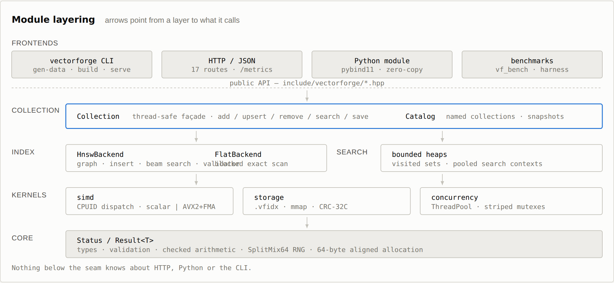
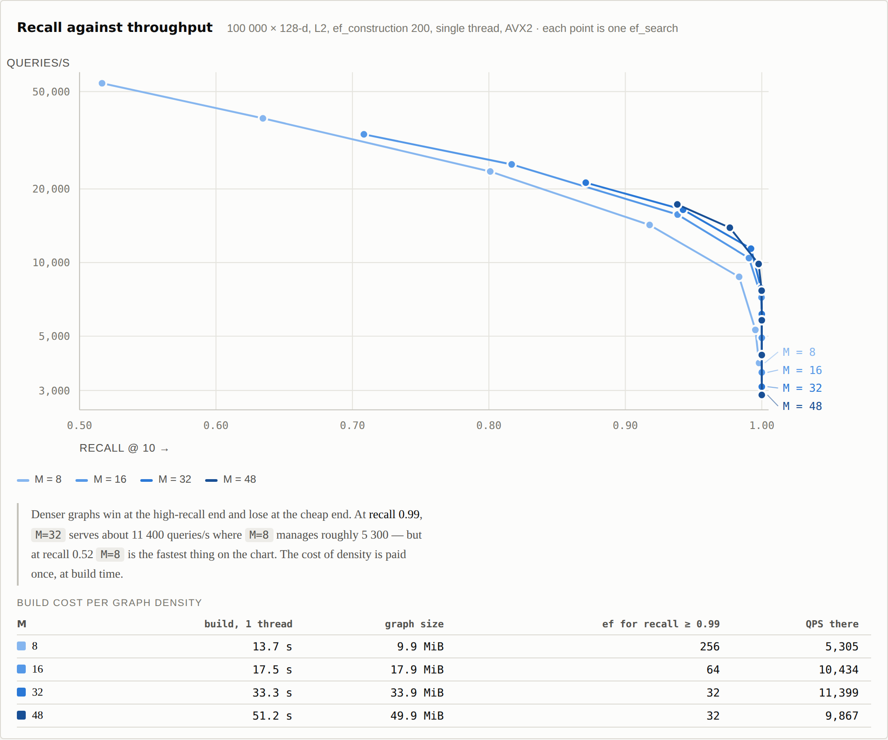
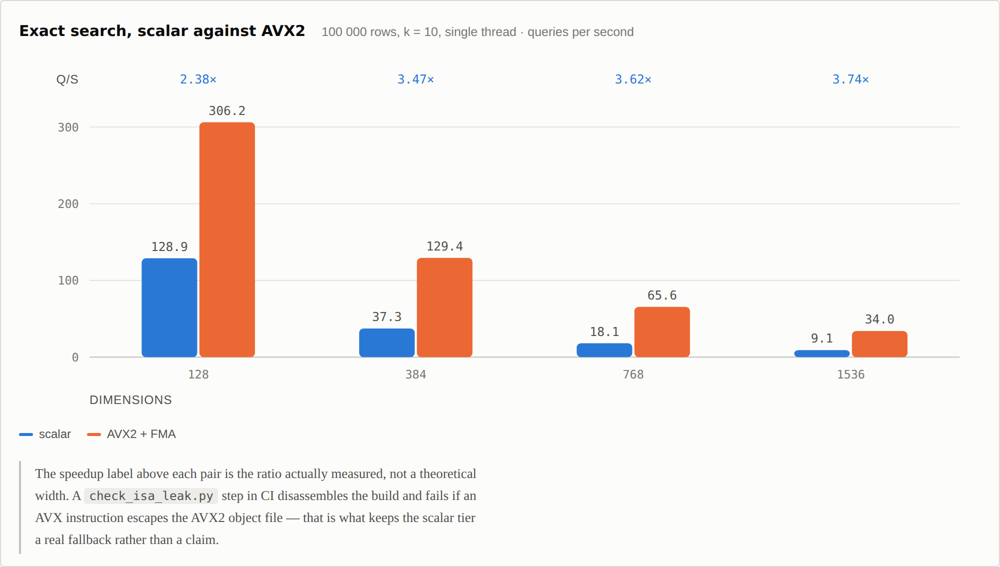
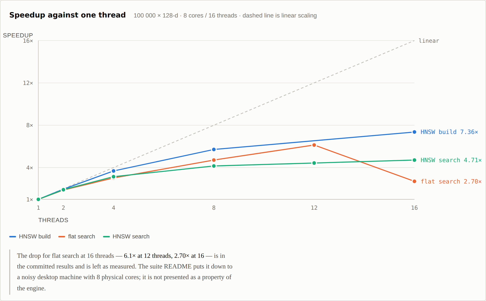
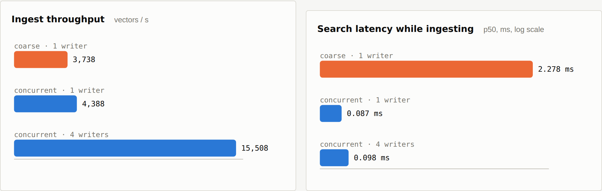
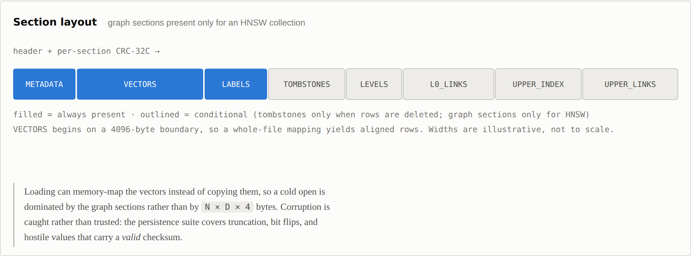

# Visual overview

How VectorForge is layered, and what it measures. Every figure is drawn from the result files
committed under [`benchmarks/results/`](../benchmarks/results) — nothing here is illustrative.

Measured on the development laptop: AMD Ryzen 7 4800H (8 cores / 16 threads), 15.4 GB, Windows 11,
MSVC 19.50 Release, AVX2 tier. Synthetic Gaussian-mixture data, 100 clusters, seed 1, metric L2,
1 000 queries. Methodology and what was *not* run: [benchmarking.md](benchmarking.md).

> An interactive version of this page, with hover readouts on every data point, is
> [`docs/overview.html`](overview.html). GitHub shows `.html` as source, so open that file
> in a browser (or serve `docs/` over GitHub Pages) rather than clicking it here.

## Architecture

Nine modules, layered so each depends only on the ones beneath it. The core library pulls in no
third-party code; the CLI, server, tests and benchmarks are the only things that do.

Prose version, with the per-layer detail: [architecture.md](architecture.md).

## The recall / throughput trade-off

HNSW answers queries by walking a graph. `M` — how many neighbours each node keeps — is fixed when
the graph is built; `ef_search`, the beam width, is chosen per query. Widening the beam buys recall
and costs throughput. Each curve is that trade for one graph density, and each point is one
`ef_search` from 10 to 512.

Denser graphs win at the high-recall end and lose at the cheap end. At recall 0.99, `M=32` serves
about 11 400 queries/s where `M=8` manages roughly 5 300 — but at recall 0.52 `M=8` is the fastest
thing on the chart. The cost of density is paid once, at build time: `M=48` takes 51.2 s to build
against 13.7 s for `M=8`, and a 49.9 MiB graph against 9.9 MiB.

Tuning guidance and the insertion algorithm: [hnsw.md](hnsw.md).

## What the AVX2 kernels are worth

Distance kernels are compiled for both tiers and selected at runtime from CPUID, so one binary runs
everywhere. The gain grows with dimension: at 128 components the loop is short enough that overhead
dominates; by 1536 the vector unit is doing nearly all the work.

The speedup above each pair is the ratio actually measured, not a theoretical vector width. A
`check_isa_leak.py` step in CI disassembles the build and fails if an AVX instruction escapes the
AVX2 object file — that is what keeps the scalar tier a real fallback rather than a claim.

Kernel variants and the prefetch experiment: [simd.md](simd.md).

## Concurrency, including where it stops helping

Builds parallelise well. Searches do not, past a point: once the working set outgrows cache the
workload is memory-bound and extra threads buy progressively less.

The drop for flat search at 16 threads — 6.13× at 12 threads, 2.70× at 16 — is in the committed
results and is left as measured. The suite README attributes it to a noisy desktop machine with 8
physical cores; it is not presented as a property of the engine.

This is the case the fine-grained index exists for. Under the coarse reader/writer lock a search
competing with one writer sits at 2.278 ms; the concurrent index answers in 0.087 ms — about 26×
lower — while ingesting faster. Four writers reach 15 508 vectors/s without pushing median search
latency past 0.1 ms.

Locking model and the guarantees searches actually get: [concurrency.md](concurrency.md).

## The on-disk format

A `.vfidx` file is a header plus typed sections, each covered by a CRC-32C.

`VECTORS` begins on a 4096-byte boundary, so a whole-file mapping yields aligned rows and the loader
can skip reading them entirely — a cold open is dominated by the graph sections rather than by
`N × D × 4` bytes. Corruption is caught rather than trusted: the persistence suite covers truncation,
bit flips, and hostile values that carry a *valid* checksum.

Byte-level layout: [storage-format.md](storage-format.md).

## What these numbers do not cover

- **One machine, one run each.** Nothing here is a cross-platform or cross-CPU comparison.
- **Synthetic data.** No real-world embedding set has been measured, and real data has structure
  that changes recall.
- **Single node, single process.** No replication, no sharding.
- **Recall falls with scale at a fixed beam.** At 1 M × 128-d, `ef_search = 64` gives recall 0.79,
  and reaching 0.95 needs 256. Larger collections need a wider beam, not the defaults tuned at 100 K.
- Timings were taken on a desktop OS with other processes live; the thread-scaling tail above 12
  threads is visibly noisy.

The full result tables are in the [README](../README.md#performance), generated from the same files
by `benchmarks/scripts/make_readme_tables.py`.
